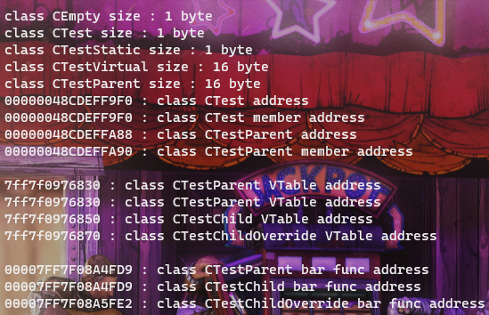

- [용어 정리](#용어-정리)
- [Enum, Enum class 차이](#enum-enum-class-차이)
- [const pointer](#const-pointer)
- [동적할당](#동적할당)
- [레퍼런스](#레퍼런스)
- [구조체](#구조체)
- [메모리](#메모리)
  - [프로그램 실행 순서](#프로그램-실행-순서)
- [재귀함수](#재귀함수)
- [문자열](#문자열)
- [파일 입출력](#파일-입출력)
- [클래스](#클래스)
  - [Uniform Initailizer](#uniform-initailizer)
  - [헤더 파일](#헤더-파일)
- [변수 범위, 주기, 링크](#변수-범위-주기-링크)
- [키워드](#키워드)
  - [sizeof 연산자](#sizeof-연산자)
  - [this 키워드](#this-키워드)
  - [static 키워드](#static-키워드)
  - [extern 키워드](#extern-키워드)
  - [inline 키워드](#inline-키워드)
- [연산자](#연산자)
  - [캐스팅 연산자](#캐스팅-연산자)
  - [범위 지정 연산자](#범위-지정-연산자)
- [함수](#함수)
  - [멤버 함수와 가상 함수 예제](#멤버-함수와-가상-함수-예제)
  - [함수 포인터](#함수-포인터)
  - [가상 함수](#가상-함수)

---


## CPP Study
  - 몰랐거나 까먹기 쉬운 정보를 기록해놓는 문서

  - 알아야 할 것 : 프로그래밍 설계패턴 (컴포넌트 지향 프로그래밍, 데이터 지향 프로그래밍, 등등), 함수 호출 규약, 메모리 단편화, 전처리기 동작, static 변수, 함수 메모리 접근방식
  - 생성자 디폴트 매개변수는 선언, 정의부가 구분되었을 경우 선언시에 해준다. 정의할 때는 디폴트 매개변수를 적어주지 않아도 된다.
    - 생성자 제한으로 특정 객체에서만 생성가능하게 제한하는 방법?
  - 접근제한자는 컴파일 타임에만 고려되나? 코드작성을 위해서 만들어진건가?

---
# 용어 정리

  - 이름 : 무언가를 지칭하는 단어. 가장 큰 개념

  - ### [`identifier` (식별자)](https://docs.microsoft.com/en-us/cpp/cpp/identifiers-cpp?view=msvc-170)
    - 이름들을 지칭하는 일련의 문자열
    - 코드에 적힌 예약되지 않은 이름들은 전부 식별자
  - ### [`keyword` (키워드)](https://docs.microsoft.com/en-us/cpp/cpp/keywords-cpp?view=msvc-170)
    - 특별한 의미로 사용하기 위해 언어가 예약한 식별자. 식별자로 사용할 수 없다.
    - 두 개의 연속된 밑줄을 포함하는 식별자(ex, `__stdcall`)는 컴파일러 구현을 위해 예약된 것이다.
      - `__cdecl` 키워드는 밑줄 없이 사용이 가능하다.
  - ### `entity` (엔터티, 개체)
    - 데이터 또는 정보들의 집합을 포함하는 어떤 메모리 (또는 레지스터)
    - 식별자로 네이밍 한다. (identifier is just a name for some entity)
    - 종류 : `values`, `objects`, `references`, `enumerators`, `types`, `functions`, `class members`, `namespaces`, `templates(specializations 포함)`, `structured bindings(C++17)`, `parameter packs`
    - 전처리기인 매크로 (`macro`)는 엔터티가 아니다.
  - ### [`types` (타입, 유형)](https://en.cppreference.com/w/cpp/language/type)
    - 무언가의 종류를 나타내기 위해 사용하는 엔터티
    - `객체, 참조, 함수 및 식`이 가지는 **속성**이며, 엔터티에 허용되는 연산을 제한하고 비트 시퀀스에 의미를 부여한다.
  - ### [`object` (객체)](https://en.cppreference.com/w/cpp/language/object)
    - 공식적인 정의는 **어떠한 저장 영역(`any region of storage`)** 이다.
    - `C++` 에서 `object` 와 `instance` 는 동의어다.
      - `instance` 는 공식적으로 정의된 용어가 아니지만 `instance of type X` 이런식으로 객체를 표현한다.
    - `변수(variable)` 는 선언을 완료한 정적 데이터 멤버인 객체 또는 참조를 의미한다.
      - 여기서 정적 데이터는 키워드인 `static`의 의미가 아닌 정해진(`fixed`)을 뜻한다.
    - 아래의 속성들을 가진다.
      - 크기 (sizeof)
      - [정렬 필요조건 (alignment requirement)](https://en.cppreference.com/w/cpp/language/object#Alignment)
        - 객체를 생성할 수 있는 연속된 주소들 사이의 바이트 수
        - 메모리 최적화에 사용하는듯? 
      - [저장 기간 (storage duration)](https://en.cppreference.com/w/cpp/language/storage_duration)
      - [수명 (lifetime)](https://en.cppreference.com/w/cpp/language/lifetime)
      - 타입
      - 값
      - 이름 (optional)

  - ### [선언(declaration)과 정의(definition)](https://docs.microsoft.com/en-us/cpp/cpp/declarations-and-definitions-cpp?redirectedfrom=MSDN&view=msvc-170)
    - 둘의 가장 큰 차이점은 **메모리를 할당하는가** 이다.
    - 메모리를 할당하지 않고 식별자만 알려준다면 `선언`, 메모리가 할당된 식별자는 `정의`
    - 선언(`declaration`)
      - 엔터티의 타입과 기타 다른 특성에 대한 정보를 가지고 엔터티에 고유한 이름을 지정하는 것
      - 정의하기 전에 사용하기 위해 선언하는 것을 `전방 선언(forward declaration)` 이라고 한다.
    - 정의(`definition`)
      - 엔터티가 프로그램에서 사용될 때 컴파일러가 기계어 코드를 생성하는데 필요한 모든 정보를 제공하는 것
      - 클래스 작성은 선언과 동시에 정의를 하는 것과 같다. (멤버함수는 선언과 정의를 분리할 수 있다)

  - 간단한 포함관계 
    - 실체가 없는 것 : 이름 > 식별자 > 키워드
    - 실체가 있는 것 : 엔터티 > 객체, 타입
  - 참고 
    - [Basic Concept of C++ Language](https://en.cppreference.com/w/cpp/language/basic_concepts) 
    - [identifier vs keyword](https://stackoverflow.com/questions/7279227/c-what-is-the-difference-between-identifier-keyword-name-and-entity)
    - [entity vs identifier](https://stackoverflow.com/questions/13542905/whats-the-difference-between-entity-and-identifier)
    - [difference between object and instance](https://stackoverflow.com/questions/22206044/difference-between-object-and-instance-c)
    - [Class and Objects](https://isocpp.org/wiki/faq/classes-and-objects#overview-object)


---
# Enum, Enum class 차이

  - `enum`은 옛날 cpp 버전 지원용

  - `int` 형의 `enum` 변수를 자유롭게 사용하기 때문에 가독성 문제, 범위 지정문제가 발생하고, 개발자가 실수를 할 확률도 있기 때문에 좀 더 제약을 준 `enum class`가 나왔다.
  - `enum`은 스코프 지정을 하지 않고 변수명을 그대로 상수마냥 사용할 수 있지만 `enum class`는 반드시 스코프를 사용해야 한다.
  - `enum class` 는 클래스이기 때문에 선언 후 정의가 가능하다.
  - 이제는 `enum class`를 사용하는 것이 맞다


---
# const pointer

  - `const type*`, `type* const`, `const type* const` 세 가지가 있다.
    - `const type*` : 값 변경 불가능, 주소 변경 가능, 상수 참조 가능
    - `type* const` : 값 변경 가능, 주소 변경 불가능, 상수 참조 불가능
    - `const type* const` : 값 변경 불가능, 주소 변경 불가능
  - `const type&` 를 생각하면 쉬움 (함수 파라미터로 자주 사용 -> 왜? -> 읽기 전용으로 쓰기 때문)

  - 상수는 일반 포인터로 참조 불가능, `const pointer`를 사용해야 한다.
  
```cpp
  const int constNumber = 999;
  int	normalNumber = 1010;
  const int* pLeftConst = &constNumber;    // 상수 참조 가능
  pLeftConst = &normalNumber;              // 주소 변경(참조) 가능
  //*pLeftConst = 500;                     //! 값 변경(역참조) 불가능

  int* const pRightConst = &normalNumber;
  //int* const pRightConst = &constNumber; //! 상수 참조 불가능
  //pRightConst = &Number2;                //! 주소 변경 불가능
  *pRightConst = 9090;                     // 값 변경 가능

  const int* const pAllConst = &Number1;
  //pAllConst = &normalNumber;            //! 주소 변경 불가능
```


---
# 동적할당

  - `crtdbg.h` 헤더 안의 매크로로 디버그 모드 시 메모리 릭을 확인할 수 있다.

```cpp
  #include <crtdbg.h>
  // 할당된 메모리 체크(alloc memory define) | 릭 체크 (leak check define)
  _CrtSetDbgFlag(_CRTDBG_ALLOC_MEM_DF | _CRTDBG_LEAK_CHECK_DF);
```


---
# 레퍼런스

  - 포인터와 기능은 동일 -> c++ 버전의 포인터, 사용하기 쉬운 포인터

  - 역참조 필요없음, 일종의 대리자 역할
  - 참조 변경 불가능 -> `type* const`와 동일
    - `const type&`을 사용하면 읽기 전용 변수가 된다.
  - 일반적인 객체가 아니기 때문에 저장공간을 반드시 필요로 하는 것은 아니다.
    - 컴파일러가 구현 중에 필요할 경우 알아서 공간을 만든다.
    - 메모리가 할당될 경우 포인터와 같은 크기이다.
    - `sizeof()`연산자 사용 불가


---
# 구조체

  - `프로젝트 속성 -> 코드 생성 -> 구조체 멤버 맞춤` 옵션이 `기본값`으로 설정되어 있을 경우 구조체 내에서 용량이 가장 큰 변수의 크기를 기본값으로 잡아서 메모리를 할당하게 된다.
    - 왜 `1byte`로 설정하지 않는가? -> 컴퓨터 입장에서는 `4의 배수` 또는 `2^n` 단위로 메모리를 할당하는 것이 더 효율적이다.
  - 멤버가 없더라도 최소바이트인 1바이트가 할당된다.
    - 변수를 정의하게 되면 메모리에 공간이 잡혀야 하므로 최소 바이트 수인 1바이트 공간을 차지하게 하여 변수를 잡아주는 것이다. (객체를 구분하기 위해)
  - 이제와서는 클래스와 구조체의 차이는 접근 제한자의 적용유무 밖에 없다.
    - 구조체 내에서도 함수를 선언할 수 있다.

```cpp
  // 이 구조체의 크기는 24바이트이다. -> |A B       |    Number    | intNum C   | -> 8바이트가 기본단위가 되었다.
  struct Test {
    char	A;
    char	B;
    double	doubleNum;
    int		intNum;
    char	C;
  };

  // 이 구조체의 크기는 1바이트이다.
  struct Test1 {
  };
```


---
# 메모리

  - cpp의 메모리 영역은 크게 4가지로 나뉜다 : 스택, 데이터, 힙, 코드

  - **텍스트 or 코드** : 유저가 작성한 코드가 저장되는 영역
    - 
    - 컴파일러가 작성한 코드를 바이너리코드(0, 1 로 구성된 코드)로 만든 뒤 실행파일을 생성한다.
  
    - 실행파일을 더블클릭해서 실행을 하게 되면 바이너리 코드가 메모리에 올라가는데(Load) 이 때 운영체제가 맨 처음 접근하는 곳이 코드 영역이다.
    - 읽기 전용이다.
  - **데이터** : `전역변수`, `정적(static)변수`들의 메모리가 할당되는 영역
    - 
    - `전역변수` : 함수의 외부에 선언된 변수
  
    - `rodata`, `data`, `bss` 로 영역이 나뉜다.
      - `rodata` : 상수 키워드(const)로 선언되는 영역, 시스템에 사용된 각종 문자열들을 포함. 읽기 전용이지만 데이터 영역에 존재한다.
      - `data` : 읽기, 쓰기가 가능한, 초기화된 전역변수 또는 정적변수를 포함
      - `bss(block stated symbol)` : 초기화되지 않았거나 0으로 초기화하는 전역변수 또는 정적변수를 포함
    - 프로그램이 종료될 때 메모리에서 정리가 된다.
  - **힙** : 동적할당된 메모리가 할당되는 영역
    - 
    - 런타임 시 크기가 정해진다.
 
    - 선입선출(FIFO) 방식으로 가장 먼저 들어온 데이터가 가장 먼저 나간다.
    - 메모리의 낮은 주소에서 높은 주소로 할당된다.
    - 힙 영역이 스택 영역을 침범하는 경우를 `힙 오버플로우`라고 부른다.
  - **스택** : `매개변수` 혹은 `지역변수`들의 메모리가 할당되는 영역
    - 
    - `매개변수` : 함수의 인자
    
    - `지역변수` : 함수의 내부에서 선언된 변수
    - 컴파일 시 크기가 정해진다.
    - 후입선출(LIFO) 방식으로 가장 늦게 들어온 데이터가 가장 먼저 나간다.
    - 메모리의 높은 주소에서 낮은 주소로 할당된다.
    - 왜 스택이 쌓일수록 메모리 주소값이 낮아지도록 설계했나?
      - 스택메모리가 커널 영역의 반대방향으로 쌓이기 때문에 커널의 영역을 침범하지 않는다.

      - 힙 영역과 공유 라이브러리 영역을 가운데 두고 마주보는 형태이기 때문에 메모리를 최대한 활용할 수 있다.
    - 스택 영역이 힙 영역을 침범하는 경우를 `스택 오버플로우`라고 부른다.


  - 참고
    - [SPARC Assembler Memory Map](https://shinluckyarchive.tistory.com/159)
    - [데이터 영역과 .bss 영역의 차이](https://kldp.org/node/122255)
    - [정적 지역 변수 원리](https://dataonair.or.kr/db-tech-reference/d-lounge/technical-data/?mod=document&uid=235959)

## 프로그램 실행 순서


---
# 재귀함수

  - 특징
    - 무한 루프에 빠지지 않기 위해 일정한 탈출 조건이 있어야 한다.(base case)
    
    - 코드를 단순화할 수 있다.
    - 호출 시마다 스택 공간을 이용하므로 무리하게 호출하면 스택 오버플로우가 발생한다.
    - 호출 횟수가 스택의 남은 공간과 재귀 함수의 지역 변수 사이즈에 따라 달라진다.
    - 디버깅 및 실행 흐름을 파악하기 힘들다.
  - 함수의 인자로 결과값만을 넘겨주는 `꼬리재귀` 함수가 있다.
    - 재귀 호출 이후 추가적인 연산을 하지 않아야 한다.

    - 컴파일러 최적화 옵션을 사용하면 컴파일러가 재귀함수를 선형으로 처리한다.
    - 최적화를 사용하려면 `프로젝트 속성 -> 최적화 -> 속도 우선 최적화` 를 체크해야 한다. (`Tail Call Optimization`이 포함된 최적화)
      - 컴파일러가 자체적으로 `do while`로 해석하게 된다.
  - 읽기 좋은 글 : [하노이의 탑](https://shoark7.github.io/programming/algorithm/tower-of-hanoi)

```cpp
// 일반 재귀 함수
  int factorial(int number) {
    if (number == 1)
      return 1;

    return number * factorial(number - 1);
  }

  // 꼬리 재귀 함수
  int factorialTail(int number, int result = 1) {
    if (number == 1)
      return result;

    return factorialTail(number - 1, result * number);
  }


  // 컴파일러가 해석하는 꼬리 재귀 함수
  int factorialTail(int number) {
    int result = 1;
    do {
      if (number == 1)
        return result;
      result = result * number;
      number = number - 1;
    } while(true);
  }
```


---
# 문자열

  - `memset` 함수는 1바이트 단위로 값을 채워넣기 때문에 주의해서 사용해야 한다.

```cpp
  // 1번인자 : 메모리 주소
  // 2번인자 : 채워줄 값
  // 3번인자 : 채워줄 메모리 크기
  memset(NumberArray, 1, sizeof(int) * 10);
  // -> 각 배열엔 1이 아닌 16,843,009가 들어가게 된다 (2^24 + 2^16 + 2^8 + 1)
```

  - `memcpy` 함수와 `std::copy` 함수의 비교 시 미묘하게 `memcpy` 가 빠르지만 iterator 등을 생각했을 때 유연한 적용은 `std::copy`가 좋다.
  - `C pointer` 타입은 `memcpy`, 나머지는 `std::copy` 를 사용하자.


---
# 파일 입출력

  - 모드의 종류
    - `w, r, a, wt, rt, at, wb, rb, ab, r+, w+, a+`
    - w : 쓰기, 이미 있으면 덮어씀
  
    - r : 읽기, 파일이 없으면 에러가 발생. File스트림이 nullptr로 들어오게 된다.
    - a : 파일이 있으면 해당 파일을 연다. 파일이 있다면 해당파일의 가장 뒤에 새로 추가해서 넣어준다. 파일이 없으면 새로 만들어준다.
    - t, b : 텍스트 파일, 바이너리 파일을 만들어준다.
    - r+ : 파일이 있으면 읽기 쓰기 둘다 가능하게 열어준다. 파일이 없으면 에러를 발생한다.
    - w+ : 파일이 있으면 읽기 쓰기 둘다 가능하게 열어준다. 파일이 없으면 새로 만들어준다.
    - a+ : 파일이 있으면 맨 끝부터 읽고 쓰기가 가능하다. 파일이 없으면 새로 만들어준다.

```cpp
  FILE* File = nullptr;
  fopen_s(&File, "Test.txt", "rt");

  if (File) {
    char Line[256] = {};

    // 문자열을 읽어온다. 한줄을 읽어오는 기능인데 개행문자까지 읽는다.
    // 읽은 뒤 뒤에 `\0`을 넣는다. 즉 문자는 255개(n - 1개) 까지만 읽을 수 있다.
    // `test\nstring` 이라는 문자열을 파일에 넣고 읽으면 첫번째 Line값은 `test\n`이 되고 strlen() 함수 사용 시 5가 나온다.
    fgets(Line, 256, File);

    std::cout << Line;
    while (true) {
      fgets(Line, 256, File);
      if (feof(File))
        break;

      std::cout << Line;
    }
    fclose(File);
  }
```


---
# 클래스

  - 구조체처럼 여러 변수를 모아두고 하나로 묶어서 사용할 수 있는 기능을 제공한다.
    
  - C++에서는 객체를 만들기 위한 수단으로 클래스를 제공한다.
  - 사용자 정의형 (`user-defined type`) 이다.
  - **캡슐화** : 여러 변수와 함수를 모아서 하나의 클래스 혹은 구조체로 만들어주는 것을 말한다.
  - **은닉화** : 클래스에서 제공하는 멤버를 외부에 공개하는 수준을 정하는 것을 말한다.
  - `friend CTestClass` : `CTestClass` 에게 접근허가를 내어준다. `CTestClass` 는 이 클래스의 `private` 데이터에 `public` 처럼 접근이 가능하다.
    - 현재 클래스에서는 `CTestClass`의 `private` 데이터에 접근할 수 없다. 단방향임.

## [Uniform Initailizer](https://modoocode.com/286)

  - `class A` 가 있고 인자를 받지 않는 생성자를 가지고 있을 때, `A a();` 라인은 객체 `a`를 만드는 것이 아닌 `A`를 리턴하고 인자를 받지 않는 함수 `a` 를 선언한 것으로 간주한다.
    - CPP 컴파일러는 함수의 선언처럼 보이는 것들을 모두 함수의 선언로 해석한다.

  - ()가 함수를 선언하는 데에도 사용되고, 객체의 생성자를 호출하는 데에도 사용되기 때문에 `c++11`부터 도입되었다.
  - 생성자 호출에 () 대신 {} 를 사용하면 된다.
  - 암시적 타입 변환을 사용하지 못한다.
  - 함수 리턴 시 생성자의 객체 타입을 적지 않아도 된다. (리턴 타입을 보고 추론해준다)
  - 생성자에 배열처럼 리스트를 집어넣을 수 있다.(`initalizer_list`)
    - 생성자 오버로딩 시 해당 함수가 최우선이 되어 예기치 못한 에러가 발생할 수 있다.

    - `auto`로 타입을 지정한다면 아래와 같은 상황에서 전부 `std::initializer_list<int>` 타입으로 추론되기 때문에 `c++17`부터 두 가지 형태로 구분해서 추론하도록 변경되었다.
      - `auto x = {arg1, arg2...}` 형태의 경우 arg1, arg2 ... 들이 모두 같은 타입이라면 x 는 `std::initializer_list<T>` 로 추론

      - `auto x {arg1, arg2, ...}` 형태의 경우 만일 인자가 단 1 개라면 인자의 타입으로 추론되고, 여러 개일 경우 오류를 발생
    - 문자열 `auto` 사용 시 `initializer_list<const char*>`로 추론되는 상황을 방지하기 위해 `c++14`에서 추가된 리터럴 연산자를 사용하는게 좋다.
  
```cpp
auto a = {1};     // 첫 번째 형태이므로 std::initializer_list<int>
auto b{1};        // 두 번째 형태 이므로 그냥 int
auto c = {1, 2};  // 첫 번째 형태이므로 std::initializer_list<int>
auto d{1, 2};     // 두 번째 형태 인데 인자가 2개 이상이므로 컴파일 오류

using namespace std::literals;  // 문자열 리터럴 연산자를 사용하기 위해 추가해줘야함.
auto list = {"a", "b", "cc"};   // initializer_list<const char*>
auto list = {"a"s, "b"s, "c"s}; // initializer_list<std::string>
```

## 헤더 파일

  - 순환 참조 : 서로의 헤더 파일을 `include` 하는 상태. 무조건 피해야 한다.
  - 이것을 피하기 위해 `전방 선언` 을 한다.


---
# [변수 범위, 주기, 링크](https://www.learncpp.com/cpp-tutorial/scope-duration-and-linkage-summary/)
  - 참고 : [Storage class specifiers](https://en.cppreference.com/w/cpp/language/storage_duration)

  - `Scope`
    - 
    - 식별자의 `scope`는 소스파일 내에서 어디까지 접근할 수 있는가를 결정한다.

    - ### `block(local) scope` : 선언된 블록 내에서만 접근 가능하다.
      - 지역변수 (`local variables`)
      - 매개변수 (`function parameter`)
      - 블록 내 유저 정의 자료형 (`user-defined type definitions declared inside a block`)
    - ### `global(file) scope` : 소스파일의 모든 위치에서 접근 가능하다.
      - 전역변수 (`global variables`)
      - 일반함수 (`normal function`)
      - 유저 정의 자료형 (`user-defined type definitions declared inside a namespace or in the global scope`)

  - `Duration`
    - 
    - 변수의 `duration`은 언제 생성되고 소멸되는지를 결정한다.

    - ### `automatic duration` : 선언(`definition`) 시점에 생성, 해당 변수가 포함된 블록이 끝날 때 파괴된다.
      - 지역변수 (`local variables`)
      - 매개변수 (`function parameter`)
    - ### `static duration` : 프로그램 시작 시 생성, 프로그램이 끝날 때 파괴된다.
      - 전역변수 (`global variables`)
      - 정적지역변수 (`static local variables`)
    - ### `dynamic duration` : 프로그래머가 요청 시 생성 혹은 파괴된다.
    
      - 동적 할당 변수 (`dynamically allocated variables`)

  - `Linkage`
    - 
    - 식별자의 `linkage`는 같은 이름의 식별자가 여러 개 선언되었을 때 같은 식별자를 참조하는가 다른 식별자로 인식하는가를 결정한다.

    - ### `no linkage` : 자기 자신만을 참조한다.
      - 지역변수 (`local variables`)
      - 블록 내 유저 정의 자료형 (`user-defined type definitions declared inside a block`)
    - ### `internal linkage` : 내부 링크, 선언된 소스파일 어디에서나 접근이 가능하다.
      - 정적전역변수 (`static global variables`)
      - 상수전역변수 (`const global variables`)
      - 정적함수 (`static function`)
      - 네임스페이스 내 유저 정의 자료형 (`user-defined type definitions declared inside an unnamed namespace`)
    - ### `external linkage` : 외부 링크, 선언된 소스파일 + 다른 파일에서도 접근이 가능하다.
      - 일반함수 (`normal function`)
      - 비상수 전역변수 (`non-const global variables`)
      - 외부전역변수 (`extern global variable`)
      - 인라인 상수전역변수 (`inline const global variables`), (`C++17`)


---
# [키워드](https://docs.microsoft.com/en-us/cpp/cpp/keywords-cpp?view=msvc-170)

## sizeof 연산자

  - 타입 이름 또는 단항연산 표현(`unary-expression`)을 인자로 받는 연산자.

  - `size_t` 타입의 결과를 생성한다.
    - 인텔리센스로 연산 결과값을 바로 알 수 있다. (`4Ui64` : 64비트 운영체제 부호 없는 정수형(`unsigned integral`) 타입의 크기 4)
  - 타입 이름을 제외한 나머지 연산 시 괄호를 사용하지 않아도 된다(!)
  - 절대 0이 결과값으로 나오지 않는다. (나누기 같은 구문에서 에러를 발생시킬 수 있기 때문에 최소값을 1로 정해놓았다.)
  - 배열 식별자의 경우 배열의 총 바이트 수를 산출한다. 포인터 타입은 포인터 크기가 나온다.
  - 클래스, 구조체, 유니온의 경우 컴파일러 옵션(`/Zp`) 또는 `pack pragma`에 따라 각각의 멤버 변수 크기의 합과 다를 수 있다.
  - 컴파일 타임에 크기가 정해지지 않거나 텍스트 영역에 저장되는 함수(함수포인터는 가능)는 연산할 수 없다.
  - 참고
    - [클래스의 크기](https://blog.naver.com/tipsware/221090063784)

## [this 키워드](https://docs.microsoft.com/en-us/cpp/cpp/this-pointer?view=msvc-170)

  - 클래스, 구조체, 유니온 안의 `비정적(nonstatic) 멤버 함수`에서만 접근할 수 있는 포인터

  - 객체의 한 부분이 아니기 때문에 `sizeof` 연산자의 결과에 반영되지 않는다.
    - 객체 이름이 해당 객체의 주소값이기 때문에 함수 주소와 같이 코드 영역에 포함된다.
    - 때문에 `this` 는 **객체가 아닌 엔터티**이다.
  - 객체를 통해 비정적 멤버 함수가 호출되었을 때, 컴파일러는 객체의 주소를 숨겨진 인자로 전달한다.

```cpp
  myDate.setMonth(3);    // 소스 코드의 형태
  setMonth(&myDate, 3);  // 컴파일러가 해석한 형태
```
  - 객체의 멤버 함수에서 접근하는 멤버 변수의 앞에는 `this->` 또는 `(*this).` 구문이 생략되어 있다.
  - 자기 자신을 참조하는 것을 방지할 때도 사용한다. (`&object != this`)

## static 키워드

  - `static` 변수는 생성된 스코프가 종료된 이후에도 해당 값을 유지한다.

  - **단 한번만 초기화**되며, 프로그램 내내 수명이 지속된다.
  - 초기화를 하지 않고 어디에도 사용하지 않으면 메모리가 할당되지 않는다.
    - 전역변수는 초기화하면 `data`영역에, 초기화하지 않으면 `bss`영역에 올라간다.

    - `static` 객체는 초기화와 상관없이 `bss` 영역에 올라간다. 생성자를 통한 초기화는 해당 구문이 처음 수행되는 시점에 이루어진다.
      - `bss` 영역은 `dynamic initializer`를 진행하는 곳이다. (컴파일 시 값을 알 수 없는 경우 나중에 초기화를 해주는 것)

      - 이를 함수화하여 호출을하면 생성자의 호출 시점을 조정하는게 가능해진다.
      - `singleton` 클래스를 생성할 때 주의해야 한다.
  - `static` 멤버 변수는 모든 객체가 공유해야 하기 때문에 프로그램 전체 영역에서 메모리 유지가 되어야 한다. **반드시 전역 범위에서 정의 및 초기화를 수행해야 한다.**
    - 함수 내부에서는 선언만 하고 초기화를 cpp파일에서 하자.

    - `C++17` 에서는 `inline variables`를 통해 `inline` 키워드로 **선언과 동시에 초기화**가 가능해졌다! (헤더에서만 가능)
  - `static` 멤버 함수는 고유의 객체를 두고 연산이 이루어지는 것이 아니기 때문에 `함수 포인터` 취급을 한다.
    - 함수 포인터에 대입을 할 때 주소연산자(&)를 붙이지 않아도 된다. (붙여도 된다.)

    - 함수 포인터 타입에 네임스페이스를 명시하지 않아야 된다.
      - 함수 포인터는 네임스페이스에 엄격하다.
      - 정적 멤버 함수 포인터와 일반 멤버 함수 포인터는 타입이 다르다.

```cpp
// using funcPointer = void(*)();
CTest test; // static void foo() 멤버 함수를 가지고 있다.
void (*func)() = test.foo;            // ok 
void (*func2)() = CTest::foo;         // ok
void (*func3)() = &CTest::foo;        // ok 
// void (*)()" 형식의 값을 사용하여 "void (CTest::*)()" 형식의 엔터티를 초기화할 수 없습니다.C/C++(144)
// void (CTest::*func4)() = &CTest::foo; // 오류
```

  - 참고
    - [전역변수와 정적변수](https://chfhrqnfrhc.tistory.com/entry/%EC%A0%84%EC%97%AD%EB%B3%80%EC%88%98%EC%99%80-%EC%A0%84%EC%A0%81%EB%B3%80%EC%88%98)
    - [Inline Variables 정보](http://egloos.zum.com/sweeper/v/3213741)
    - [Non Static Data Members Initialization](https://www.cppstories.com/2015/02/non-static-data-members-initialization/)
    - [what is dynamic initailization](https://stackoverflow.com/questions/5945897/what-is-dynamic-initialization-of-object-in-c)
    - https://ansohxxn.github.io/cpp/chapter8-10/


## extern 키워드

  - `extern` 변수는 정의된 소스파일과 다른 소스파일에도 접근이 가능하다.

  - 기본적으로 전역변수(`global variable`)는 `extern` 변수로 간주한다. (키워드가 생략되어 있음)
    - 다른 파일에서 `extern` 키워드를 사용해서 접근할 수 있다.

    - 정의한 전역변수에는 `extern` 키워드를 붙이지 않는다. 내가 원본이기 때문.
      - 붙여도 무시된다. 헷갈리니까 붙이지 말자.
  - 다른 소스파일에서 선언된 외부전역변수를 사용하려면 변수 전방선언 (`variable forward declarations`)을 해야한다.
    - 전방선언이 함수 외부에서 선언되면 소스파일 전체에 적용되고, 함수 내에서 선언되면 해당 블록 내에서만 적용된다.

    - **키워드를 생략할 수 없다.** 생략하면 일반 변수 정의와 동일해진다.
    - 변수에 `static` 키워드가 붙어 있으면 전방선언을 해도 적용되지 않는다.
    - 함수는 기본적으로 외부 링크 속성이다. `static` 키워드를 사용하면 내부 링크로 설정이 가능하다.
  - 상수전역변수(`const global variables`)는 `static` 변수로 간주한다. 외부에서 사용하면 새로운 변수를 선언하는것과 동일함.
    - 상수를 외부 전역변수로 사용하려면 해당 변수에 `extern` 키워드를 꼭 붙여야 한다.
  - 헤더파일에서 정의할 경우 해당 헤더를 여러군데에서 쓸 경우 초기화를 여러번 수행하게 되어서 링킹 에러가 발생한다.
    - **헤더파일에는 선언만 하고 초기화를 cpp파일에서 하자.**

    - `C++17` 에서는 `inline variables`를 통해 `inline` 키워드로 **선언과 동시에 초기화**가 가능해졌다! (헤더에서만 가능)
  - 어디서 값이 바뀔 지 모르고 찾기도 힘들기 때문에 왠만해선 전역변수를 사용하지 말자.
  - 의문 : 상수전역변수는 일반 상수를 여러번 사용하는 것보다 이득인데 왜 많이 안쓰나?
    - 컴파일러가 코드 최적화를 알아서 진행한다.
    - 자세한건 컴파일러 최적화 종류와 기법을 찾아보자.
  - 참고
    - [전역 변수와 링크](https://boycoding.tistory.com/167?category=1007833)
  
```cpp
  /* 초기화 X */
  int g_x;              // external. 다른 파일에서 사본으로 쓰인다. 
  static int g_x;       // internal. 다른 파일에서 쓰일 수 없다. 이 코드 내에서만 쓰일 수 있음
  const int g_x;        // external. 에러! const는 꼭 초기화를 해주어야함
  extern int g_z;       // 이 파일을 include 하는 다른 파일에서 이 변수와 메모리를 공유하게 될 것.
  extern const int g_z; // 에러 아님! 이 변수와 메모리를  공유하는 다른 파일에서 초기화 꼭 해주면 됨.

  /* 초기화 O */
  int g_y(1);           // external. 
  static int g_y(1);    // internal. 
  const int g_y(1);     // external. 
  extern int g_w(1);    // 이제 다른 파일에서 정의가 불가능하다. 
  extern const int g_w(1); 
```

## inline 키워드

- 빨리 하자


---
# 연산자

## 캐스팅 연산자

## 범위 지정 연산자

- `::`
- 질문 : 멤버변수의 주소에 `&객체.변수` 가 아닌 `&클래스::변수` 로 접근하면 어디를 참조하게 되는것인가?


---
# 함수

## 멤버 함수와 가상 함수 예제

  - `std::addressof() (C++17)` 를 확인해보자.

```cpp
class CEmpty {};
  class CTest {
  public:
    char a;
    void foo(){}
    void bar(){}
  };
  class CTestStatic {
  public:
    char a;
    static char b, c, d;
    void foo(){}
    static void bar(){}
  };
  class CTestVirtual {
    public:
    char a;
    void foo(){}
    virtual void bar(){}
  };
  class CTestParent {
    public:
    char a;
    virtual void foo(){}
    virtual void bar(){}
  };
  class CTestChild : public CTestParent {};
  class CTestChildOverride : public CTestParent {
    public:
    void bar(){}
  };

int main() {
  CEmpty empty;                 // 빈 클래스
  CTest test;                   // 기본 클래스
  CTestStatic stat;             // 정적변수, 함수가 포함된 클래스
  CTestVirtual virt;            // 한 개의 가상함수를 포함하는 클래스
  CTestParent parent, parent2;  // 두 개의 가상함수를 포함하는 클래스
  CTestChild child;             // 상속받지만 가상함수를 재정의하지 않은 클래스
  CTestChildOverride overrided; // 상속받은 가상함수를 재정의한 클래스
  
  //  크기 비교
  // 1. empty 클래스도 스택 영역에 메모리가 올라간다.
  // 2. static 멤버 변수는 클래스의 크기에 영향을 주지 않는다. (bss 영역에 올라감)
  // 3. 가상함수를 포함하는 클래스는 주소 크기만큼 크기가 커진다. 주소값이 8바이트이기 때문에 16바이트(구조체 멤버 맞춤 옵션)의 결과가 나온다.
  // 4. 가상함수의 개수는 크기와 상관없다. -> 가상함수 테이블은 배열? 리스트? 로 생성되며 클래스들은 테이블의 주소를 가진다.
  std::cout << typeid(empty).name() << " size : " << sizeof empty << " byte\n";   // 1 byte
  std::cout << typeid(test).name() << " size : " << sizeof test << " byte\n";     // 1 byte
  std::cout << typeid(stat).name() << " size : " << sizeof stat << " byte\n";     // 1 byte
  std::cout << typeid(virt).name() << " size : " << sizeof virt << " byte\n";     // 16 byte
  std::cout << typeid(parent).name() << " size : " << sizeof parent << " byte\n"; // 16 byte
  
  // cout에 멤버 변수의 주소를 인자로 받는 오버로딩 함수가 없기 때문에 캐스팅 없이 출력하면 가장 적합하게 처리할 수 있는 함수를 고른다.
  // 멤버 변수는 출력하면 아무 값도 안나온다. (어떤 타입 인자를 처리하는 함수인지 모르겠음)
  // reinterpret_cast 연산자는 임의의 포인터 타입끼리 변환을 허용하는 캐스트 연산자다.
  // 오버로딩 함수 중 void* 형의 인자를 받는 함수가 있기 때문에 캐스팅 후 출력한다.
  // printf를 사용하면 캐스팅을 하지 않아도 되는데, printf는 가변 인자를 통해 처리하는 방식이기 때문이다.
  //
  //  가상함수 테이블 주소 위치 확인
  // 1. 가상함수 테이블의 주소는 객체 메모리의 가장 앞부분에 추가된다. (현재 환경에 영향을 받는건가?)
  std::cout << std::hex;
  std::cout << typeid(test).name() << " address : \t\t\t" << &test << '\n';        // &test == &test.a
  std::cout << typeid(test).name() << " member address : \t\t" << reinterpret_cast<void *>(&test.a) << '\n';
  std::cout << typeid(parent).name() << " address : \t\t" << &parent << '\n';    // &parent + 8 == &parent.a
  std::cout << typeid(parent).name() << " member address : \t" << reinterpret_cast<void *>(&parent.a) << '\n';
  //printf("%p\n", &test.a); // 캐스팅을 하지 않아도 된다.
  //printf("%p\n", &parent.a);
  std::cout << std::endl;

  //  가상함수 테이블 주소값 비교
  // 1. 클래스 별 가상함수 테이블의 주소값은 멤버 함수와 관계없이 전부 다르다.
  // 2. 동일 클래스의 객체들은 가상함수 테이블을 공유한다.
  size_t parentVTAddr = 0;
  size_t parent2VTAddr = 0;
  size_t childVTAddr = 0;
  size_t overridedVTAddr = 0;
  memcpy(&parentVTAddr, &parent, sizeof size_t);
  memcpy(&parent2VTAddr, &parent2, sizeof size_t);
  memcpy(&childVTAddr, &child, sizeof size_t);
  memcpy(&overridedVTAddr, &overrided, sizeof size_t);
  std::cout << typeid(parent).name() << " VTable address : \t" << parentVTAddr << '\n';     // 7ff788805860  
  std::cout << typeid(parent2).name() << " VTable address : \t" << parent2VTAddr << '\n';   // 7ff788805860  
  std::cout << typeid(child).name() << " VTable address : \t" << childVTAddr << '\n';       // 7ff788805880  
  std::cout << typeid(overrided).name() << " VTable address : " << overridedVTAddr << '\n'; // 7ff7888058a0
  std::cout << std::endl;

  // 객체에서 멤버 함수에 접근해 주소를 얻으려하면 오류가 발생한다.(&test.bar -> C/C++(300)오류)
  // 함수 호출 코드에서 실제 호출할 함수를 결정하는 것을 함수 바인딩이라 하는데, 객체를 동적할당하지 않으면 컴파일 시점에 해당 객체가 호출할 함수를 결정한다. (static binding)
  // 이 바인딩 된 객체의 함수 포인터는 호출 외에 다른 용도로 사용할 수 없기 때문에 오류가 발생하는 것이다.
  // 멤버 함수 이름(&CTest::foo)을 통해 주소를 구하려고 하면 캐스팅 타입이 맞지 않다고 오류가 발생한다. (C/C++(171)) (static 멤버 함수는 전역 함수와 동일한 함수 포인터 타입이기 때문에 캐스팅을 안해도 된다.)
  // void * 는 유저가 원하는 타입으로 형변환이 가능하지만 멤버 함수를 나타내는 함수 포인터로는 변환이 불가능하다. 참고 : http://www.cplusplus.com/forum/general/38453/
  // TODO : 그래서 참조자(&)를 사용해서 우회 접근한다. (자세한 이유를 알아보자)
  // 참조자는 r-value를 허용하지 않기 때문에 멤버 함수 포인터 변수를 생성하여 출력한다.
  // printf는 캐스팅 할 필요가 없으니 함수 이름을 그대로 사용 가능하다.
  //
  //  멤버 함수 주소값 비교
  // 1. 재정의 하지 않은 상속 관계의 클래스들의 멤버 함수는 같은 주소값을 가진다.
  // 2. 재정의한 멤버 함수는 다른 주소값을 가진다.
  // 3. 멤버 함수 포인터는 묵시적 형변환을 허용하지 않는다. this 포인터 때문에 네임스페이스가 굉장히 중요하기 때문이다.
  // std::cout << CTestStatic::bar << '\n'; // static 멤버 함수는 주소연산자(&)를 붙이지 않아도 된다.
  void (CTestParent::*pParentFoo)() = &CTestParent::foo;
  void (CTestParent::*pParentBar)() = &CTestParent::bar;
  void (CTestParent::*pChildFoo)() = &CTestChildOverride::foo;
  // void (CTestParent::*pChildBar)() = &CTestChildOverride::bar;
  void (CTestChildOverride::*pOverrideFoo)() = &CTestChildOverride::foo;
  void (CTestChildOverride::*pOverrideBar)() = &CTestChildOverride::bar;
  
  std::cout << typeid(parent).name() << " foo func address : \t" << reinterpret_cast<void *&>(pParentFoo) << '\n';    // 00007FF788732437    
  std::cout << typeid(parent).name() << " bar func address : \t" << reinterpret_cast<void *&>(pParentBar) << '\n';    // 00007FF788734FD9    
  std::cout << typeid(child).name() << " foo func address : \t" << reinterpret_cast<void *&>(pChildFoo) << '\n';      // 00007FF788732437    
  // std::cout << typeid(child).name() << " bar func address : " << reinterpret_cast<void *&>(pChildBar) << '\n';
  std::cout << typeid(overrided).name() << " foo func address : " << reinterpret_cast<void *&>(pOverrideFoo) << '\n'; // 00007FF788732437
  std::cout << typeid(overrided).name() << " bar func address : " << reinterpret_cast<void *&>(pOverrideBar) << '\n'; // 00007FF788735FE2
  // printf("%p\n", &CTestParent::foo); // 캐스팅을 하지 않아도 된다.
  std::cout << std::endl;

  std::cout << "계속하려면 아무 키나 누르십시오..." << '\n';
  _getch();
  //system("pause");

  return 0;
}
```
<p align="center">  </p>

  - 참고
    - [함수의 주소 출력](https://bigpel66.oopy.io/library/cpp/etc/1) 
    - [C++에서 함수 포인터 사용하기](https://blog.naver.com/tipsware/221619466275)


## 함수 포인터

  - `리턴 타입 (*포인터 이름)(매개변수)` 의 형태를 가진 포인터 타입이다. (`C`와 동일한 형태)
    - 이름에 괄호를 넣은 이유는 `포인터 변수를 리턴하는 함수의 전방선언` 으로 해석될 여지가 있기 때문이다. 괄호의 추가로 우선순위가 높아졌다.

```cpp
  int *Func();   // Func 함수의 전방 선언(forward declaration)
  int (*pFunc)(); // int(*)() 형의 함수 포인터 정의
```
  - 함수의 이름 앞에 `주소연산자(Address-of operator, &)`를 붙여 주소를 대입할 수 있다.
  - 주소연산자의 생략이 가능하다.
  - 포인터로 함수 호출 시, 암시적 역참조를 허용하여 일반 함수 호출과 동일한 형태로 사용이 가능하다.
  
```cpp
  (*Func)(); // 원래 형태
  Func();    // 암시적 추론을 통한 역참조
```
  - 멤버 함수는 위의 전역 함수, 정적 멤버 함수가 사용하는 타입과 형태가 다르다.
    - `리턴 타입 (소속 클래스::*포인터 이름)(매개변수)`

    - 함수의 주소가 대입, 사용될 때의 소속과 this 포인터의 자료형을 결정하기 위해 `범위 지정 연산자(::)`를 사용하여 어디 영역의 함수인지 정확히 지정해주어야 한다.
    - `&소속 클래스::함수명` 의 형태로 주소를 대입해야 한다.
    - 주소연산자 생략 시 `비표준 구문`으로 처리해서 컴파일 시 오류가 발생한다.
      - 함수 이름의 표현법을 다양한 문법에서 사용하기 때문에 구분을 명확히 하기 위해 비표준 처리
    - `&객체.함수명` 을 대입할 경우 `바인딩 오류`가 발생한다. (윗문단 코드의 주석에 설명있음)
    - 포인터 사용 시 `포인터-멤버 연산자 (.*, ->*)` 를 이용하여 객체와 연결한다.


## 가상 함수

  -