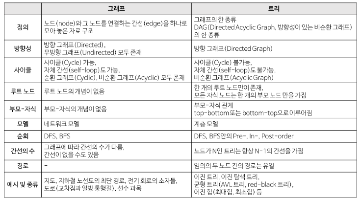

- [STL의 Allocator 분석](#stl의-allocator-분석)
- [Hash table](#hash-table)
  - [해시 충돌 해결방법](#해시-충돌-해결방법)
  - [`unordered_map` 동적 할당 메모리 사용량 (64비트 기준)](#unordered_map-동적-할당-메모리-사용량-64비트-기준)
- [Tree](#tree)
  - [Binary Tree](#binary-tree)
  - [Heap](#heap)
- [Disjoint Set (서로소 집합)](#disjoint-set-서로소-집합)

---


## Data Structure
  - 자료구조 관련 정보들을 저장해놓는 문서

  - 참고
    - [Containers library](https://en.cppreference.com/w/cpp/container)
    - [실전 알고리즘 강좌](https://blog.encrypted.gg/category/%EA%B0%95%EC%A2%8C/%EC%8B%A4%EC%A0%84%20%EC%95%8C%EA%B3%A0%EB%A6%AC%EC%A6%98)
    - [C++ STL 컨테이너의 메모리 사용량 1](https://www.secmem.org/blog/2019/11/14/c++-container-memory-usage/)


---
# STL의 Allocator 분석

  - STL의 모든 자료구조가 해당 클래스의 함수로 메모리를 할당받길래 궁금해서 찾아봄
  - TODO

---
# Hash table

  - 해시 함수가 다른 키값에 동일한 해시 코드를 출력할 경우 `해시 충돌`이 발생한다.

  - 참고
    - [실전 알고리즘 해시](https://blog.encrypted.gg/1009?category=773649)

## 해시 충돌 해결방법

  - `Chaining`
    - 해시 테이블 인덱스에 해당하는 자료구조를 연결 리스트로 만드는 방법
    - 동일한 해시 키를 갖는 페어를 리스트에 넣기만 하면 된다.
    - 값을 찾을 때는 리스트를 순회한다. -> `worst case`의 경우 조회 복잡도가 $O(n)$이 된다.
  - `C++`은 해시 충돌 해결 방법으로 `Chaining`을 선택했다. 
    - 각 버킷이 리스트를 갖는 형태가 아니고 리스트가 1개 있고 버킷은 자신이 필요로 하는 노드의 포인터를 값으로 가진다.


## `unordered_map` 동적 할당 메모리 사용량 (64비트 기준)

  - 특성 정보(`_Umap_traits`) 초기화가 일어나지만, 자세한건 모르니 넘어간다. (TODO)
 
  - 맨 처음으로 버킷의 요소인 리스트 (`_List`)를 초기화한다. (벡터인 버킷의 초기화 전에 발생한다.)
    - 리스트는 `_List_node`와 `_List_val`의 페어인 `_Mypair` 변수를 가지고 있다.
      - `_List_node` 구조체는 자기 자신의 포인터 타입인 `_Prev`와 `_Next`, 리스트 값의 타입인 `_Value_type` 변수를 가진다.
 
      - `_List_val` 클래스는 `_List_node`의 포인터 타입인 `_Myhead`와 `size_t` 타입인 `_Mysize` 변수를 가진다.
 
    - 리스트의 생성자에서 `_List_node` 포인터 형태의 `_Newhead`를 생성한다. 이 객체는 `_Myhead` 와 연결된다.
    - 서클 링크드 리스트의 형태이다.
    - 동적 할당 메모리 크기는 `16 + map의 페어 타입 크기` 가 된다.
  - 두 번째로 해시 벡터(`_Hash_vec` 구조체 타입인 `_Vec`)를 초기화 한다.
    - 해시 벡터는 `_List_node`의 반복자 타입인 `_Aliter`와 `_Vector_val`의 페어인 `_Mypair` 변수를 가지고 있다.
      - `_Vector_val` 클래스는 `_Aliter`의 포인터 타입인 `_Myfirst`, `_Mylast`, `_Myend` 변수를 가진다.
  - 키의 마스크 값인 `_Mask` 와 버킷의 크기인 `_Maxidx` 를 초기화한다.
    - `_Mask` 값은 해시 키 체크값으로 사용해야 하기 때문에 `_Maxidx` - 1 이다.
  - 마지막으로 해시 벡터의 크기를 `_Min_buckets * 2 = 16` 만큼 할당한다.
    - `static constexpr _Min_buckets` 의 값은 8이다.
 
    - `STL` 은 버킷의 크기가 `실제 테이블에 들어있는 값`의 **2배보다 항상 크다**는 것을 알 수 있다.
    - 벡터의 크기를 늘릴 때 벡터 안에 있던 값들은 복사하지 않고 초기값(`_MyHead`)으로 변경한다.
      - 어차피 새로운 `해시 함수`를 사용해서 재배치(rehash) 해야 하기 때문이다.
  
      - 테이블에 값이 많이 들어와서 재배치 할 때는 초기화와 함께 리스트를 끝까지 돌면서 `해시 키`를 다시 뽑아낸 후 벡터에 값을 대입한다.
    - 동적 할당 메모리 크기는 `8 * 16 = 128` 이 된다.
  - `unordered_map` 에 값을 추가할 때마다 `_List_node` 의 크기만큼 동적 할당이 발생한다.
    - `std::pair` 는 구조체라 바이트 패딩이 적용된다. 계산할 때 주의할 것
   
    - `std::string`의 크기는 `32 byte` 이다.
  - 추가한 값의 개수가 `bucket_count()` 값과 동일해지는 순간 재배치(rehash)가 발생한다.
    - 버킷의 크기는 $2^3 -> 2^6 -> 2^9$ 순으로 커진다.
   
    - 벡터의 크기는 `버킷의 크기 X 2` 이다.
    - 실제로 할당되는 바이트 수는 약간 달랐다. ($2^9$일 때, 8231 byte가 할당되었다. 예상은 8192 byte 였음)

```cpp
	std::cout << "\n -arch=x64 build\n" << std::endl;

	std::cout << "unordered_map<int, int64_t> define" << std::endl;
	std::unordered_map<int, long long> map;
	std::cout << "\nsizeof map" << std::endl;
	std::cout << sizeof(map) << std::endl;
	std::cout << "\nmap initial bucket_count() : ";
	int count = map.bucket_count();
	std::cout << count << std::endl;
	for (int i = 0; i <= count; ++i) {
		std::cout << "map.emplace " << i + 1 << std::endl;
		map.emplace(std::make_pair(i, i));
	}
	std::cout << map.bucket_count() << std::endl;
	std::cout << "\n delete dynamic duration" << std::endl;
```


  - 참고
    - [다시 정리하는 C++ STL 자료구조](https://ssinyoung.tistory.com/48)
    - [C++ STL 컨테이너의 메모리 사용량 2](https://www.secmem.org/blog/2019/12/13/c++-container-memory-usage-2/)


---
# Tree

  - `노드`로 이루어진 자료구조
 
  - 하나의 `루트 노드`를 가지며, 0개 이상의 `자식 노드`를 갖고 있다. 자식 노드는 하나의 `부모 노드`만을 갖는다. 각 노드들은 모두 동일한 속성을 가진다.
  - `트리 구조`란 `vertex(= node)`와 `edge(간선)`로 구성된 [그래프](https://ko.wikipedia.org/wiki/%EA%B7%B8%EB%9E%98%ED%94%84_(%EC%9E%90%EB%A3%8C_%EA%B5%AC%EC%A1%B0))의 일종으로, `순환 연결`이 없는 연결 그래프이다.
    - `순환 연결` : 특정 노드에서 출발해 다른 노드를 거쳐 다시 해당 노드로 돌아올 수 있는 연결 구조 (`cycle`의 존재 여부)
    - `DAG(Directed Acyclic Graph, 방향성이 있는 비순환 그래프)`의 한 종류이다.
  - 노드가 `N` 개인 트리는 `N - 1` 개의 간선을 가진다.
  - 임의의 두 노드를 연결하는 경로가 유일하다. 즉, 두 개의 정점 사이에 1개의 경로만이 존재한다.
  - 노드들을 순회하는 방법으로 `Pre-Order`, `In-Order`, `Post-Order` 세 방법이 있다.

  - 각 노드들이 두 개의 자식 노드를 갖는 트리를 `이진 트리(Binary Tree)`라고 한다. (`degree of tree`가 2인 트리)
  - `레벨`은 0부터 시작(루트 노드의 레벨은 0), `깊이`, `높이`는 1부터 시작(루트 노드만 가진 트리의 높이는 1)

  
  
  - 참고
    - https://gmlwjd9405.github.io/2018/08/12/data-structure-tree.html
    - https://code-lab1.tistory.com/8

## Binary Tree

  - `Complete Binary Tree (완전 이진 트리)`
    - 마지막 레벨을 제외한 트리 내 모든 레벨이 완전히 노드로 채워진 트리
   
    - `부모 - 왼쪽 자식 - 오른쪽 자식 - ...` 순으로 채워져 있어야 한다.
    - 마지막 레벨에서만 `1 ~ 2h(h는 레벨)` 개의 노드를 가질 수 있다. 물론 왼쪽부터 채워넣어야 한다.
    - 위의 순서대로 배열에 노드의 키값을 채워넣을 때, 배열의 끝까지 빈 공간이 없다. (모든 노드로 채워진다.)
 
  - `Full Binary Tree (전 이진 트리)`
    - 모든 노드가 0개 또는 2개의 자식 노드를 가지는 트리
  - `Perfect Binary Tree (포화 이진 트리)`
    - 모든 레벨이 노드로 꽉 차 있는 트리
    - `완전 이진 트리` + `전 이진 트리`
    - 노드 개수가 `2^k-1` 로 정해져 있다. `k` 는 높이 이다.

  - `이진 탐색 트리`
    - 각 노드에 중복되지 않는 `키`가 존재한다.
    - 루트 노드를 기준으로 `좌측 자식 노드 - 루트 노드 - 우측 자식 노드` 순으로 대소 관계가 성립한다.
    - 삽입 시 대상 노드의 위치를 찾아가기 때문에 $logN$의 시간복잡도를 가진다.
    - 삭제의 경우, 가지고 있는 서브트리가 두 개인 경우 자식 중 특정 조건에 해당하는 자식을 현재 노드의 위치로 변경하는 작업이 필요하다.
      - 참고 : https://code-lab1.tistory.com/10

## Heap

  - `완전 이진 트리`의 형태를 기본으로 하는 자료구조(`tree-based structure`)
  - 아래의 `힙 속성(property)`을 만족한다.
    - `A` 가 `B` 의 부모 노드이면, `A` 의 키 값과 `B` 의 키 값 사이에는 대소 관계가 성립한다.
  - `힙 속성`을 만족하도록 자료구조를 수정하는 연산을 `heapify` 라고 한다.
  
  - 부모 노드의 키 값이 자식 노드의 키 값보다 항상 큰 힙을 `Max Heap`, 항상 작은 값을 가지는 힙을 `Min Heap`이라고 한다.
  - 부모 자식 관계에서만 대소 관계가 성립하기 때문에 형제 사이(Sibling)에는 대소 관계를 알 수 없다. (느슨한 정렬 상태)
  - 최댓값 및 최솟값을 빠르게 찾아내기 위해 사용한다.
    - 가장 높은(혹은 가장 낮은) 우선순위를 가지는 노드가 항상 `뿌리 노드`에 오게 되는 특징이 있다.
 
    - 이를 응용하면 `우선순위 큐`와 같은 추상적 자료형을 구현할 수 있다.


---
# Disjoint Set (서로소 집합)

  - `서로 중복되지 않는 부분 집합들`로 나누어진 원소들에 대한 정보를 조작하는 자료구조
  - `Union–find (합집합-찾기)` , `Merge–find set (병합-찾기 집합)` 이라고도 한다.
  - `Union`, `Find`, `MakeSet` 등의 기능을 제공한다.
    - `Union` : 두 개의 집합을 하나로 합친다.
    - `Find` : 어떤 원소가 주어졌을 때 이 원소가 속한 집합을 반환한다. 보통 집합을 대표하는 원소를 반환한다.
    - `MakeSet` : 특정 한 원소만을 가지는 집합을 생성한다.
  - 보통 `트리 구조`로 구현하여 `그래프` 에서 두 노드가 같은 집합에 속하는지 판단하는 데 사용한다.

  - 참고
    - https://ko.wikipedia.org/wiki/%EC%84%9C%EB%A1%9C%EC%86%8C_%EC%A7%91%ED%95%A9_%EC%9E%90%EB%A3%8C_%EA%B5%AC%EC%A1%B0