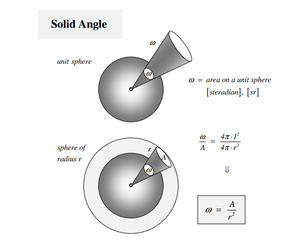
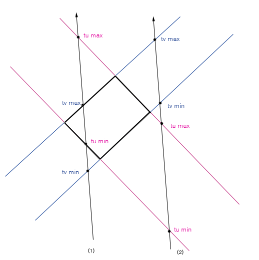

- [행벡터와 열벡터](#행벡터와-열벡터)
- [좌표계 변환](#좌표계-변환)
- [선분의 방정식](#선분의-방정식)
- [곡선 방정식](#곡선-방정식)
  - [베지에 곡선 (Bezier Curve)](#베지에-곡선-bezier-curve)
  - [에르밋 곡선 (Hermite Curve)](#에르밋-곡선-hermite-curve)
  - [퍼거슨 곡선 (Ferguson Curve)](#퍼거슨-곡선-ferguson-curve)
  - [스플라인 (Spline)](#스플라인-spline)
    - [B-Spline 곡선 (Basic Spline Curve)](#b-spline-곡선-basic-spline-curve)
    - [스플라인 보간법 (Spline Interpolation)](#스플라인-보간법-spline-interpolation)
- [곡면 방정식](#곡면-방정식)
- [입체각 (Solid Angle)](#입체각-solid-angle)
- [충돌](#충돌)
  - [두 선분의 교차점 구하기](#두-선분의-교차점-구하기)
  - [Cohen-Sutherland 선분 알고리즘](#cohen-sutherland-선분-알고리즘)
  - [선분과 원의 교차 확인](#선분과-원의-교차-확인)
  - [OBB 충돌 (Oriented-Bounding Box) 충돌](#obb-충돌-oriented-bounding-box-충돌)
  - [반직선(Ray)과 구의 충돌 확인](#반직선ray과-구의-충돌-확인)
  - [반직선(Ray)과 OBB의 충돌 확인](#반직선ray과-obb의-충돌-확인)

 
## GameMath 

  - 게임에서 사용하는 수학 정보들

  - 참고
    - https://wjs7347.tistory.com/17
  - Easing Function
    - https://easings.net/ko
    - https://github.com/nicolausYes/easing-functions/blob/master/src/easing.cpp


---
# 행벡터와 열벡터

  - https://angeloyeo.github.io/2020/09/09/row_vector_and_inner_product.html
  - https://developer0hye.tistory.com/entry/%EC%9D%B8%EA%B3%B5%EC%A7%80%EB%8A%A5%EC%9D%84-%EC%9C%84%ED%95%9C-%EC%84%A0%ED%98%95%EB%8C%80%EC%88%98-%EC%84%A0%ED%98%95%EB%8C%80%EC%88%98%EC%9D%98-%EA%B8%B0%EC%B4%88?category=965709
  - https://gosamy.tistory.com/250


---
# 좌표계 변환

  - ### 어떤 한 좌표계에서 일어나는 모든 움직임들은 `다른 좌표계`에서 보면 반대로 보인다.
    - `좌표계 내의 한 점`을 다른 좌표계로 이동시키는 것과, `좌표계` 자체를 이동시키는 것은 서로 반대다.
  - `좌표계` 의 이동은 `좌표계 단위 벡터`의 이동과 동일하다.
  - 어떤 한 좌표계를 다른 좌표계로 변환한다는 것은 `좌표계 단위 벡터`를 `다른 좌표계 단위 벡터`와 동일한 값으로 바꾼다는 말과 동일하다.
  - 이 때 `원래 좌표계`의 좌표들은 가만히 있지만, `좌표계`의 입장에서는 `상대적`으로 이동을 한 것처럼 보인다.
    - `원점`을 앞으로 이동시키면, `원래 좌표계에 있는 한 점`은 **원점에서 봤을 때 뒤로 간다.**
  - 결국 이동한 `원래 좌표계`는 `새로운 좌표계`가 되고, `원래 좌표계의 값`들은 좌표계 움직임의 반대로 이동한 것처럼 계산되어 `새로운 좌표`가 된다.
  - ### **좌표계 변환 행렬** 은 `이동할 좌표계로 표현된 현재 좌표계의 표준기저벡터(standard basis vector)` 들로 만들 수 있다.
      - [자세한 내용: 좌표계 변환](Transformation/transformations.md#좌표계의-변환)

  - ### 위치 변환
    - 보통 같은 좌표계에서 이동할 때 **해당 좌표를 더한다**.
   
    - `좌표계 이동`은 상대적인 움직임이다.
    - 그러므로 `현재 좌표계`에서 `원하는 좌표계의 기준`을 빼주면 `좌표계` 변환이 된다.
    - `현재 좌표계 값` - `원하는 좌표계 원점`(현재 좌표계) = `원하는 좌표계 값`
    - `월드 좌표` - `카메라 위치`(월드 좌표계) = `카메라 좌표`(카메라 좌표계)
  
  - ### 회전 변환
    - 어떤 좌표 $p(x, y)$ 를 $\theta$ 만큼 회전시킬 때, 변환 후 좌표 $p(x', y')$ 는 아래의 식과 같다.

      $$
        x' = xcos\theta - ysin\theta\\
        y' = xsin\theta + ycos\theta
      $$

    - 위의 식은 `행렬식`의 형태를 띄기 때문에 행렬로 나타낼 수 있다.

      $$
      \begin{pmatrix} x' \\ y' \end{pmatrix}
      = \begin{pmatrix}
        cos\theta & -sin\theta\\ 
        sin\theta & cos\theta
        \end{pmatrix}
        \begin{pmatrix} x \\ y \end{pmatrix}
      $$

    - `DX`에서는 `행벡터`를 사용하기 때문에 해당 행렬의 `전치 행렬`을 변환에 사용해야 한다.


    - `좌표계 이동`은 상대적인 움직임이기 때문에 **$-\theta$ 만큼 회전시키면 $\theta$ 회전 변환이 된 좌표계** 내의 좌표값이 나온다.
    - `회전 변환`에서 `열벡터`와 `회전 행렬`을 곱할 경우(행렬 * 벡터) 해당 각도만큼 `좌표`가 회전이 되고, `행벡터`와 `회전 행렬`을 곱할 경우(벡터 * 행렬), 해당 각도만큼 `좌표계`가 회전이 된다.(좌표계 이동이 발생한다.)
      - `행렬 * 열벡터` : `좌표`가 이동. `좌표계`는 그대로 존재.
      - `행벡터 * 행렬` : `좌표계`가 이동. 좌표는 이동하지 않지만 새로운 값을 얻어 `새로운 좌표계`에서의 좌표를 나타내게 됨.
    - **보통 `좌표계`의 변환을 하는 경우가 많다.** `행벡터 * 행렬`의 식을 사용하거나, 회전 각도를 반대로 해서 `행렬 * 열벡터`의 식을 사용하면 된다.


---
# 선분의 방정식

  - 매개변수를 이용한 표현법 (내분점, 외분점)
  - t가 해당 범위를 벗어나면 `직선의 방정식`과 동일해진다.
  
  $$
\begin{aligned}
  x &= (1 - t)x_1 + tx_2 \\
  y &= (1 - t)x_1 + tx_2 
\end{aligned} \quad (0 \le t \le 1)
  $$

  - 직선의 방정식의 표준형 (기울기와 y절편을 이용한 표현)
  - 수평선이나 수직선은 기울기와 y절편의 정확한 값이 안나올 수 있다.

$$
  \begin{aligned}
  y = mx + b \quad
  \end{aligned} \\
  \begin{aligned}
  (y - y_0)(x_1 - x_0) &= (x - x_0)(y_1 - y_0) \\
  y - y_0 &= \frac{y_1 - y_0}{x_1 - x_0} (x - x_0) \\
  m &= \frac{y_1 - y_0}{x_1 - x_0} \\
  b &= y_0 -\frac{y_1 - y_0}{x_1 - x_0}x_0
  \end{aligned}
$$

  - 직선의 방정식의 일반형

$$
  \begin{aligned}
   Ax + By + C = 0 
  \end{aligned} \\
  \begin{aligned}
  (y - y_0)(x_1 - x_0) &= (x - x_0)(y_1 - y_0) \\
  y(x_1-x_0) - y_0(x_1-x_0) &= x(y_1 - y_0) - x_0(y_1 - y_0) \\
  0 &= x(y_1 - y_0) - y(x_1-x_0) - x_0(y_1 - y_0) + y_0(x_1-x_0) \\
  A &= (y_1 - y_0) \\
  B &= -(x_1 - x_0) \\
  C &= -x_0(y_1 - y_0) + y_0(x_1-x_0) = -(x_0y_1 - x_1y_0) = -외적값\\
  \end{aligned}
$$

---
# 곡선 방정식

  - 참고
    - [곡선 & 스플라인](https://tsyang.tistory.com/57)
    - [비 스플라인](https://www.banditong.com/cae-dict/b_spline)
    - [What exactly are knots (b-spline)](https://stackoverflow.com/questions/32855446/what-exactly-are-knots-b-spline)

## 베지에 곡선 (Bezier Curve)

  - 


## 에르밋 곡선 (Hermite Curve)

  - `베지에 곡선`과 상호변환이 가능
    - `베지에 곡선`의 또다른 표현방식


## 퍼거슨 곡선 (Ferguson Curve)

  -


## 스플라인 (Spline)

  - 일차원 혹은 다차원 Data를 보간(interpolation) 혹은 곡선 맞춤(curve fitting)을 위해 사용되는 광범위한 종류의 함수
  - 구간별로 정의된 미분 가능한 다항함수(polynomial)들로 연결된 하나의 특별한 함수


### B-Spline 곡선 (Basic Spline Curve)

  - `Internal Knot`이 없는 B-Spline은 `베지에 곡선`과 동일하다.


### 스플라인 보간법 (Spline Interpolation)

  - 전체 선 구간을 각각의 소구간으로 나누어 낮은 차수의 다항식으로 매끄러운 곡선 함수를 표현하는 방법
  - `구간별 다항식 보간법(Piecewise Polynomial Interpolation)` 이라고도 한다.


---
# 곡면 방정식

 - TODO


---
# 입체각 (Solid Angle)

  - ### 구의 반지름의 제곱과 구 표면상의 폐곡면의 넓이가 같아지는 중심각의 크기
 
  - 단위는 **스테라디안(steradian, $sr$)** 을 사용한다.
  - 반지름이 1인 구와 $r$인 구의 넓이 비를 이용해 중심각 $\omega$를 구할 수 있다.
    - 반지름이 $r$인 구의 표면적 넓이는 $4\pi r^2$ 이다.
    - 반지름이 1인 구의 입체각은 표면적 넓이와 같다 -> $4\pi  1^2 = 4\pi$ 
    - $\therefore$ 반지름이 $r$이고 폐곡면의 넓이가 $A$인 입체각 $\omega$ 스테라디안은 다음의 비례식으로 정리할 수 있다.
      - $1^2 : \omega = r^2 : A$
  - 2차원의 각을 3차원으로 확장한 개념
    - 2차원의 각 `라디안`의 정의는 **원의 반지름과 호의 길이가 같아지는 중심각의 크기 (호도, $rad$)** 이다.
  - 입체각이 매우 작아지면 입체각이 만들어내는 원뿔의 밑면 넓이로 수렴한다.
    - 카메라로 들어오는 빛의 입체각은 렌즈의 넓이를 대신 사용하여 근사한 입체각을 계산할 수 있다.

$$
  \begin{aligned}
\alpha &= \frac{s}{r} \quad s=arc\ length \\
\omega &= \frac{A}{r^2} \quad A=spherical\ cap\ area
  \end{aligned}
$$



  - 참고
    - https://mkpark.tistory.com/10
    - 구의 겉넓이 구하는 법 : https://color-change.tistory.com/57

---
# 충돌

## 두 선분의 교차점 구하기

  - 직선의 방정식을 `기울기`와 `절편`으로 나타내는 대신 매개변수를 이용하여 나타내면 깔끔하게 구할 수 있다. (벡터 방정식)
    - `P_1`과 `P_2` 사이를 `t : (1 - t)` 비율로 분리한 것과 같다.
  
  $$
  P(t) = (1 - t)P_1 + tP_2
  $$

  - 두 직선의 방정식을 매개변수 t, s 로 표현할 때, 2개의 식을 하나로 만들면 다음과 같다. 이 때, t와 s가 0~1 사이의 값을 가지지 않으면, **직선은 교차하지만 선분은 교차하지 않는 상태가 된다.**
  
  $$
  (1 - t)P_1 + tP_2 = (1 - s)P_1 + sP_2
  $$

  - x와 y로 분리하면 다음과 같다.
  
  $$
  x_1 + t(x_2 - x_1) = x_3 + s(x_4 - x_3) \\
  y_1 + t(y_2 - y_1) = y_3 + s(y_4 - y_3) 
  $$

  - t와 s로 정리하면 다음과 같다. (분모 같음)
  
  $$
  t = \frac{(x_4 - x_3)(y_1 - y_3) - (y_4 - y_3)(x_1 - x_3)} 
           {(y_4 - y_3)(x_2 - x_1) - (x_4 - x_3)(y_2 - y_1)} \\
  s = \frac{(x_2 - x_1)(y_1 - y_3) - (y_2 - y_1)(x_1 - x_3)} 
           {(y_4 - y_3)(x_2 - x_1) - (x_4 - x_3)(y_2 - y_1)} \\
  $$

  - t와 s는 두 선이 서로 만날때의 값이기 때문에, 최종적으로 두 선의 교점은 다음과 같다. 
  - `p - p1 : p2 - p = t : 1 - t` 닮음비를 이용한다.
  
  $$
  x = x_1 + t(x_2 - x_1) \\
  y = y_1 + t(y_2 - y_1) \\
  $$

  - 두 선분의 교차만 확인하고 싶은 경우 (게임에서 자주 사용) `외적의 방향성`을 이용해서 쉽게 구분할 수 있다.
    - 이차원 내에서 외적의 방향성은 `부호`로 나타난다.
    - 선분의 한 점에서 시작하는 벡터를 기준으로 두 점까지의 `벡터 외적값의 부호`가 다르면 교차한다고 볼 수 있다.

      
   
    - 위의 그림처럼 $\vec{ab}$ 를 기준으로 `c`와 `d`의 외적값을 비교하고, $\vec{cd}$ 를 기준으로 `a`와 `b`의 외적값을 비교하면 된다.
  
  - TODO : [크라메르 공식 (Cramer's rule)](https://ko.wikipedia.org/wiki/%ED%81%AC%EB%9D%BC%EB%A9%94%EB%A5%B4_%EB%B2%95%EC%B9%99) 을 알아보자
  
```cpp
  bool CCollisionManager::CollisionLineToLine(Vector2& hitPoint, const LineInfo& src, const LineInfo& dest) {
    // 선분의 기울기가 같은 경우
    Vector2 srcSlope = src.p2 - src.p1;
    Vector2 destSlope = dest.p2 - dest.p1;
    float under = srcSlope.Cross(destSlope);
    if (under < EPSILON && under > -EPSILON) { // 외적이 0이다 == sin 세타의 값이 0이다. == 평행하다
      // 기울기는 같지만 만나지 않는 경우 (체크하지 말자)
      return false;
      // 한 라인에 다른 라인의 점이 포함되어 있는 경우 (체크하지 말자)
    }

    // 한 선분에서 다른 선분의 두 점의 외적 값의 곱이 음수이면 선분의 좌우에 점이 존재한다.
    if (srcSlope.Cross(dest.p1 - src.p1) * srcSlope.Cross(dest.p2 - src.p1) > 0 ||
      destSlope.Cross(src.p1 - dest.p1) * destSlope.Cross(src.p2 - dest.p1) > 0)
      return false;

    // 선분의 기울기가 다른 경우
    // 매개변수(피벗)를 이용한 직선 내 좌표 공식 : P(t) = (1 - t) * p1 + t * p2
    float _t = (dest.p2.x - dest.p1.x) * (src.p1.y - dest.p1.y) - (dest.p2.y - dest.p1.y) * (src.p1.x - dest.p1.x);
    // t는 _t/외적 이다. 0과 1사이의 값이면 교차, 아니면 교차하지 않는다.
    float t = _t / under;
    if (t < 0.f || t > 1.f)
      return false;
    // hit - p1 : p2 - hit = t : 1 - t 닮음비를 이용한다.
    hitPoint.x = src.p1.x + t * (src.p2.x - src.p1.x);
    hitPoint.y = src.p1.y + t * (src.p2.y - src.p1.y);

    // s를 써도 히트포인트는 똑같다. 안해도 됨
    //float _s = (src.p2.x - src.p1.x) * (src.p1.y - dest.p1.y) - (src.p2.y - src.p1.y) * (src.p1.x - dest.p1.x);
    return true;
  }
```

  - 참고
    - [두 선의 교차점 구하기](http://www.gisdeveloper.co.kr/?p=89)
    - [두 선분의 교차여부 체크](https://crazyj.tistory.com/140?category=753578)
    - [2d 충돌 처리](https://netcanis.tistory.com/112)
    - [A Minimal Ray-Tracer](https://www.scratchapixel.com/lessons/3d-basic-rendering/minimal-ray-tracer-rendering-simple-shapes/ray-box-intersection)
    - [두 직선의 교점 구하기](https://wjs7347.tistory.com/17)
    - [외적을 이용해서 선분과 선분의 교차점 구하기](https://bowbowbow.tistory.com/17)

---
## [Cohen-Sutherland 선분 알고리즘](https://en.wikipedia.org/wiki/Cohen%E2%80%93Sutherland_algorithm)

  - 선분과 사각형의 포함관계를 확인하는 알고리즘이다.
  - `top, bottom, right, left` 순으로 0 또는 1의 값을 줘서 비트 연산 시 나오는 값을 통해 해당 선분이 존재하는 영역을 찾아낸다.
  - 0000 영역이 비교하는 사각형의 영역이다.
  

     1. or 연산 시 0이 나오면 두 점이 가운데 있는 것이다.
  	
     2. and 연산 시 0이 아니면 선분 전체가 클리핑 외부에 있는 것이다.
  	 3. 한 점이 0이고 다른 점이 0이 아니면 선분이 사각형 경계에 걸치는 것이다.
  	 4. 나머지 (두 점이 0이 아니고 and연산시 0이 아니면) 경우는 직선방정식을 이용한다.
  - $m = (y_1 - y_0)/(x_1 - x_0), y - y_0 = m(x - x_0)$ 두 식을 사용하여 사각형의 네 선분과 비교한다.
  - 시작점이 `top` 영역에 존재하는 경우
    - $x = x_0 + (x_1 - x_0) * (y_{max} - y_0) / (y_1 - y_0)$
    - $y = y_{max}$
  - 시작점이 `bottom` 영역에 존재하는 경우
    - $x = x_0 + (x_1 - x_0) * (y_{min} - y_0) / (y_1 - y_0)$
    - $y = y_{min}$
  - 시작점이 `right` 영역에 존재하는 경우
    - $x = x_{max}$
    - $y = y_0 + (y_1 - y_0) * (x_{max} - x_0) / (x_1 - x_0)$
  - 시작점이 `left` 영역에 존재하는 경우
    - $x = x_{min}$
    - $y = y_0 + (y_1 - y_0) * (x_{min} - x_0) / (x_1 - x_0)$

```cpp
  byte CCollisionManager::ComputeOutcode(const Vector2& point, const BoxInfo& box) {
    byte outcode = 0;
    if (point.x < box.LT.x)
      outcode |= 1;
    else if (point.x > box.RB.x)
      outcode |= 2;
    if (point.y < box.LT.y)
      outcode |= 4;
    else if (point.y > box.RB.y)
      outcode |= 8;
    return outcode;
  }
  bool CCollisionManager::CollisionLineToBox(Vector2& hitPoint, const LineInfo& line, const BoxInfo& box) {
    // Cohen-Sutherland 선분 알고리즘을 사용한다.
    // top bottom right left 순으로 0 또는 1의 값을 줘서 비트 연산 시 나오는 값을 통해 해당 선분이 존재하는 영역을 찾아낸다.
    // 원래 화면 클리핑을 위해 사용하는 알고리즘이다.
    // 1001  1000  1010      y 값을 거꾸로 하면    0101   0100   0110
    // 0001  0000  0010                           0001   0000   0010
    // 0101  0100  0110                           1001   1000   1010
    // 
    // 1. or 연산 시 0이 나오면 두 점이 가운데 있는 것이다.
    // 2. and 연산 시 0이 아니면 선분 전체가 클리핑 외부에 있는 것이다.
    // 3. 한 점이 0이고 다른 점이 0이 아니면 선분이 사각형 경계에 걸치는 것이다.
    // 4. 나머지 (두 점이 0이 아니고 and연산시 0이 아니면) 경우는 직선방정식을 이용한다.
    // m = (y_1 - y_0)/(x_1 - x_0), y - y_0 = m(x - x_0) 두 식을 사용하여 사각형의 네 선분과 비교한다.
    byte outcode1 = ComputeOutcode(line.p1, box);
    byte outcode2 = ComputeOutcode(line.p2, box);

    if ((outcode1 & outcode2) != 0)			// 선분 전체가 밖에 있다.
      return false;

    if ((outcode1 | outcode2) == 0) {		// 선분 전체가 안에 있다.
      hitPoint = (line.p1 + line.p2) * 0.5f;
      return true;
    } else if (!outcode1 || !outcode2) {	// 점 하나가 사각형 안에 있다.
      hitPoint = !outcode1 ? line.p1 : line.p2;
      return true;
    } else if (outcode1 + outcode2 == 3) {	// 선분이 사각형을 가로로 자른다 (히트포인트 부정확함)
      hitPoint.x = (box.LT.x + box.RB.x) * .5f;
      hitPoint.y = (line.p1.y + line.p2.y) * .5f;
      return true;
    } else if (outcode1 + outcode2 == 12) { // 선분이 사각형을 세로로 자른다 (히트포인트 부정확함)
      hitPoint.x = (line.p1.x + line.p2.x) * .5f;
      hitPoint.y = (box.LT.y + box.RB.y) * .5f;
      return true;
    }


    byte outcode = max(outcode1, outcode2);
    Vector2 point{};
    if (outcode & 8) {       // top 부분 점과 사각형 윗변 충돌 체크
      point.x = line.p1.x + (line.p2.x - line.p1.x) * (box.RB.y - line.p1.y) / (line.p2.y - line.p1.y);
      point.y = box.RB.y;
      if (!(point.x < box.LT.x || point.x > box.RB.x)) {
        hitPoint = point;
        return true;
      }
    } 
    if (outcode & 4) {		// bottom 부분 점과 사각형 아랫변 충돌 체크
      point.x = line.p1.x + (line.p2.x - line.p1.x) * (box.LT.y - line.p1.y) / (line.p2.y - line.p1.y);
      point.y = box.LT.y;
      if (!(point.x < box.LT.x || point.x > box.RB.x)) {
        hitPoint = point;
        return true;
      }
    } 
    if (outcode & 2) {		// right 부분 점과 사각형 오른쪽변 충돌 체크
      point.y = line.p1.y + (line.p2.y - line.p1.y) * (box.RB.x - line.p1.x) / (line.p2.x - line.p1.x);
      point.x = box.RB.x;
      if (!(point.y < box.LT.y || point.y > box.RB.y)) {
        hitPoint = point;
        return true;
      }
    } 
    if (outcode & 1) {		// left 부분 점과 사각형 왼쪽변 충돌 체크
      point.y = line.p1.y + (line.p2.y - line.p1.y) * (box.LT.x - line.p1.x) / (line.p2.x - line.p1.x);
      point.x = box.LT.x;
      if (!(point.y < box.LT.y || point.y > box.RB.y)) {
        hitPoint = point;
        return true;
      }
    }

    return false;
  }
```


---
## 선분과 원의 교차 확인

  - 선분이 두 점 A와 B로 이루어져 있을 때, 원의 중심점을 C라 하고, 점 C에서 선분 AB에 수선을 내렸을 때의 교점을 D라 할 때, 아래의 두 조건을 만족하면 선분과 원이 충돌했다고 할 수 있다.
    - $\overrightarrow{AB}$의 길이가 $\overline{AD}$의 길이와 같거나 크다.
    - $\overline{CD}$의 길이가 반지름보다 작다.
  
    

  - 먼저, 선분을 구성하는 **두 점 A, B가 원의 내부에 있는지 확인한다.** 무조건 교차하기 때문
  - 두 점 A, B가 모두 원의 외부에 있는 경우 아래의 순서대로 확인한다.
  1. 선분 AB의 길이가 점 A에서 원에 접하는 접선의 길이보다 짧으면 **무조건 만나지 않는다.**
    
  $$
\overline{AB} ^2 \lt \overline{AC} ^2 - \overline{CD} ^2 \quad \Rightarrow  not\;crossing
  $$
    
  2. 접선보다 길 경우, 사인값 비교를 통해 선분 CD의 길이와 반지름 값을 비교한다.
     - 선분 CD의 길이가 반지름보다 짧으면 교차한다.
    
  $$
\frac{\overline{CD}}{\overline{AC}} \le \frac{r}{\overline{AC}} \quad \Rightarrow collision
  $$

  - 실제 코드에서 확인은 외적의 제곱을 비교하는 식으로 하면 된다.

$$
  \begin{aligned}
(\overline{AB} \times \overline{AC})^2 &= (\left\| \overline{AB} \right\| \left\|  \overline{AC} \right\| sin \theta)^2 \\
&= \left\| \overline{AB} \right\|^2 \left\|  \overline{CD} \right\|^2 \\
(\frac{\overline{AB} \times \overline{AC}}{\overline{AB}})^2 &=  \overline{CD} ^2 
\\
\therefore (\frac{\overline{AB} \times \overline{AC}}{\overline{AB}})^2 &\le  r^2 \quad \Rightarrow collision
  \end{aligned}
$$

  - 교차점의 중심을 구하는 방법은 두 가지가 있다.
  1. 원의 중심에서 선분 으로 정사영을 한 벡터로 구하는 방법
    
$$
  \begin{aligned}
  \overrightarrow{AD} =& \overrightarrow{AB} \frac{\left\| \overline{AD}\right\|}{\left\|\overline{AB} \right\|} \\
  \overrightarrow{AB} \cdot \overrightarrow{AC} = &
  \left\| \overline{AB} \right\| \left\| \overline{AC} \right\| \cos \theta \\ 
  =& \left\| \overline{AB} \right\| \left\| \overline{AD} \right\| \\
  \end{aligned}
  \begin{aligned}
  \therefore D &= A + \overrightarrow{AD} \\
  &= A + \overrightarrow{AB} \frac{\left\| \overline{AD}\right\|}{\left\|\overline{AB} \right\|}  \\
  &= A + \overrightarrow{AB} \frac{1}{\left\|\overline{AB} \right\|} \frac{\overrightarrow{AB} \cdot \overrightarrow{AC}}{\left\|\overline{AB} \right\|} \\
    &= A + \frac{\overrightarrow{AB} (\overrightarrow{AB} \cdot \overrightarrow{AC})}{\left\| \overline{AB} \right\| ^2}
  \end{aligned}\\
$$

  2. 직선의 방정식을 이용하여 x, y 절편을 구하는 방법
     - [위키](https://ko.wikipedia.org/wiki/%EC%A0%90%EA%B3%BC_%EC%A7%81%EC%84%A0_%EC%82%AC%EC%9D%B4%EC%9D%98_%EA%B1%B0%EB%A6%AC)에 공식이 나와있다.

```cpp
  bool CCollisionManager::CollisionLineToCircle(Vector2& hitPoint, const LineInfo& line, const CircleInfo& circle) {
    // 1. 선분의 끝점이 원 안에 있는지 확인
    // 2. 선분의 길이가 접선의 길이보다 짧은지 확인
    // 3. 수선의 길이가 반지름보다 작은지 확인

    if (circle.radius > circle.center.Distance(line.p1)) {
      hitPoint = line.p1;
      return true;
    } else if (circle.radius > circle.center.Distance(line.p2)) {
      hitPoint = line.p2;
      return true;
    }

    float lineSquare = line.p1.DistanceSquare(line.p2);
    float centerSquare = max(circle.center.DistanceSquare(line.p1), circle.center.DistanceSquare(line.p2));

    // 2. 선분의 길이가 접선의 길이보다 짧은지 확인 (긴 쪽을 비교해야 한다)
    if (lineSquare < centerSquare - circle.radius * circle.radius)
      return false;

    // 3. 수선의 길이가 반지름보다 작은지 확인
    float cross = (line.p2 - line.p1).Cross(circle.center - line.p1);
    if (cross * cross > circle.radius * circle.radius * lineSquare)
      return false;

    // 히트포인트는 원의 중심에서 선분으로 정사영을 한 벡터로 구한다.
    Vector2 vecAB = (line.p2 - line.p1);
    float dot = vecAB.Dot(circle.center - line.p1);
    hitPoint = vecAB * (dot / lineSquare);

    return true;
  }
```

  - 참고
    - [Line Circle Collision Detection](https://micropilot.tistory.com/2956)

  - 아래 해법은 결론이 나지 않아서 폐기
  - 근의 공식을 이용한다.


$$
ax^2 + bx + c = 0 \\
 x = \frac{-b \pm \sqrt{b^2 - 4ac}}{2a}
$$

  - t의 방정식에서 $b^2-4ac$는 항상 0보다 크기 때문에 해가 2개다.
  - 2개의 해 중 하나라도 선분의 범위에 있으면 선분과 원은 교차한다.

$$
\begin{aligned}
a &= (B - A)^2 \\
b &= 2(B - A)(A - C) \\
c &= (A - C)^2  -r^2
\end{aligned}
$$

  - $t$의 영역은 $0 \le t \le 1$이다. 범위 밖의 t값은 직선은 교차하지만 선분은 만나지 않는다는 뜻이다.
  - 좌표들로 t를 표현하면 아래와 같다.

$$
 t = \frac{-b \pm \sqrt{b^2 - 4ac}}{2a} \\
\begin{aligned}
 t &= \frac{-2(B - A)(A - C) \pm \sqrt{4r^2(B - A)^2}}{2(B - A)^2} \\
 t &= \frac{-2(B - A)(A - C) \pm 2r(B - A)}{2(B - A)^2} \\
 t &= \frac{(C - A) \pm r}{(B - A)} \\
\end{aligned}
$$

  - TODO 결론이 뭐지? 나중에 다시 한번 더 알아보자.

  - 참고
    - [선분-원 충돌 검사](https://kr.hansnotes.com/218)
    - [원과 직선의 충돌검사 알고리듬](https://dronedev.tistory.com/26)


---
## OBB 충돌 (Oriented-Bounding Box) 충돌

  - `분리축 이론(Hyperplane Separating Theorem)`을 이용하여 두 사각형의 충돌 여부를 확인한다.
    - ### `분리축 이론` : n차원에서의 임의의 두 `볼록 다면체(convex polyhedron)`가 서로 교차하지 않을 때, 두 물체 사이를 분리하는 `초평면(hyperplane)`이 반드시 존재한다. 이 때, 분리 평면에 수직인 축을 `분리축(separating axis)`라고 한다.
    
    - n차원의 도형을 분리축에 투영(projection)하여 1차원의 도형인 선으로 단순화한 후 비교하는 방식이다.
      - 보통 3차원 입체를 1차원 선으로 변경한다.
    - 수직인 벡터를 사용하는 이유는 차원을 1개 줄였을 때 해당 도형을 `충돌을 확인하기 위한 기준 영역`으로 삼기 위해서다.
      - 단순 비교식 $dist <= (a + b) / 2$ 에서 겹치는 영역이 해당 도형의 정사영과 같다.
      - 2차원 -> 정사영 결과물 : 선분,  겹치는 영역 비교 단위 : 점
      - 3차원 -> 정사영 결과물 : 평면,  겹치는 영역 비교 단위 : 선분
      - 3차원의 경우, 계산 시 법선 벡터 자체에 정사영을 하기 때문에 차원을 2개 줄인 것과 동일하게 동작한다. (다면체 -> 다각형 -> 선분 으로 단순화된다.)
    - 저차원으로 이동하여 계산하기 때문에 평행인 도형은 생략이 가능하다.
      - 평행한 두 도형은 법선 벡터가 같기 때문이다.
    - ### 검사 횟수는 2차원인 경우 만들수 있는 모든 정사영의 법선 벡터 개수와 같고, 3차원의 경우 여기에 각 모서리의 방향 벡터들의 외적 수가 추가된다.
      - 외적 벡터를 추가하는 이유는 `모서리 간 충돌 확인`을 위해 두 벡터를 가지는 평면의 법선 벡터를 생성하기 위해서다. (빈도 수가 낮지만 검사해줘야 정확하다)
        - 아마 equal이 나올 것이다...
      - 동일한 벡터는 생략이 가능하다. (당연하게도)
      - 모든 모서리가 좌표축과 평행하지 않은 두 삼각형의 경우 검사 횟수는 6회이다.
      - 모든 모서리가 좌표축과 평행하지 않은 두 사면체의 경우 검사 횟수는 4 + 4 + (4 * 4) = 24회이다.
      - 모든 모서리가 좌표축과 평행하지 않은 m면체, n면체의 경우 검사 횟수는 m + n + (m * n)회이다.
    - 정사영 시, 선분의 길이가 최대가 되는 꼭짓점을 찾는 작업이 필요하다.
  - 사각형의 충돌 확인 시, 각 모서리는 직교하기 때문에 모서리 벡터를 법선 벡터로 사용할 수 있다.
  - 분리축을 기준으로 정사영 최댓값과 최솟값을 찾아 더한 후의 길이가 중심점 사이의 길이보다 짧은 축이 존재하면 두 도형은 교차하지 않는다.
    - 최댓값에서 최솟값을 빼기 때문에 축의 길이를 구할 필요는 없다. 하지만 오버플로우가 발생할 수 있기 때문에 축을 단위 벡터 또는 그 근사값으로 지정하자.

  $$
  \begin{aligned}
    dist_{centerV_1V_2} &\gt 
      (\text{Max}(U \cdot V_1) - \text{Min}(U \cdot V_1) \\ 
    & \qquad + \text{Max}(U \cdot V_2) - \text{Min}(U \cdot V_2))  
  \end{aligned} 
  \quad (U = Separating Axis)
  \quad \Rightarrow not\;crossing
  $$

  - 분리축에 정사영한 결과값은 `분리축과 정사영할 벡터의 내적 / 분리축의 벡터 길이`값과 같다.

  $$
    \begin{aligned}
      Proj_{U}V &= \frac{V \cdot U}{|U^{2}|} U \quad (U = Separating Axis) \\
      Comp_{U}V &= |Proj_{U}V| = \frac{|V \cdot U|}{|U|} 
    \end{aligned}
  $$

  - 충돌점은 OBB를 AABB(Axis-Aligned Bounding Box)로 변경해 충돌 영역 사각형의 중심점을 사용한다.
  - 원과 OBB의 충돌 시에도 동일하게 원을 AABB로 만들어 처리한다.
    - 자세한 중심점 찾기는 [여기](https://wizardmania.tistory.com/26?category=610631) 참조

```cpp
  bool CCollisionManager::Collision2DOBBToOBB(Vector2& hitPoint, const OBB2DInfo& src, const OBB2DInfo& dest) {
    // 정사영 할 기준이 되는 축을 찾아야 한다.
    // 축은 다각형을 이루는 모서리의 법선 벡터를 사용하지만, 
    // 사각형의 경우 모든 모서리가 직교하기 때문에 각 모서리의 벡터를 그대로 사용해도 된다.
    Vector2	centerLine = src.center - dest.center;

    // 1. src 사각형의 가로 모서리 방향의 벡터를 축으로 사용하는 경우
    Vector2	axis = src.axis[AXIS2D_X];
    float centerProjDist = abs(centerLine.Dot(axis));
    float srcDist = src.length[AXIS2D_X];
    float destDist = abs(axis.Dot(dest.axis[AXIS2D_X]) * dest.length[AXIS2D_X]) +
                     abs(axis.Dot(dest.axis[AXIS2D_Y]) * dest.length[AXIS2D_Y]);
    if (centerProjDist > srcDist + destDist)
      return false;

    // 2. src 사각형의 세로 모서리 방향의 벡터를 축으로 사용하는 경우
    axis = src.axis[AXIS2D_Y];
    centerProjDist = abs(centerLine.Dot(axis));
    srcDist = src.length[AXIS2D_Y];
    destDist = abs(axis.Dot(dest.axis[AXIS2D_X]) * dest.length[AXIS2D_X]) +
               abs(axis.Dot(dest.axis[AXIS2D_Y]) * dest.length[AXIS2D_Y]);
    if (centerProjDist > srcDist + destDist)
      return false;

    // 3. dest 사각형의 가로 모서리 방향의 벡터를 축으로 사용하는 경우
    axis = dest.axis[AXIS2D_X];
    centerProjDist = abs(centerLine.Dot(axis));
    srcDist = abs(axis.Dot(src.axis[AXIS2D_X]) * src.length[AXIS2D_X]) +
              abs(axis.Dot(src.axis[AXIS2D_Y]) * src.length[AXIS2D_Y]);
    destDist = dest.length[AXIS2D_X];
    if (centerProjDist > srcDist + destDist)
      return false;

    // 4. dest 사각형의 세로 모서리 방향의 벡터를 축으로 사용하는 경우
    axis = dest.axis[AXIS2D_Y];
    centerProjDist = abs(centerLine.Dot(axis));
    srcDist = abs(axis.Dot(src.axis[AXIS2D_X]) * src.length[AXIS2D_X]) +
              abs(axis.Dot(src.axis[AXIS2D_Y]) * src.length[AXIS2D_Y]);;
    destDist = dest.length[AXIS2D_Y];
    if (centerProjDist > srcDist + destDist)
      return false;

    // 히트포인트는 대략적으로 AABB(Axis-Aligned Bounding Box)를 만들어 그 중심점을 사용한다.
	  ComputeHitPoint(hitPoint, ConvertBox2DInfo(src), ConvertBox2DInfo(dest));

    return true;
  }
```

  - 참고
    - https://wizardmania.tistory.com/28?category=610631
    - http://judis.me/wordpress/separating-axis-theorem/
    - https://www.geometrictools.com/Documentation/DynamicCollisionDetection.pdf


---
## 반직선(Ray)과 구의 충돌 확인


  - `반직선의 파라미터 방정식`을 `구 방정식`에 대입해서 근의 공식을 통해 충돌 확인을 한다.
  

```cpp
bool CCollisionManager::CollisionRayToSphere(PickingResult& result,
											 const Ray& ray,
											 const Vector3& center,
											 float radius) {
	// 광선 방정식 : ray.Pos + (ray.Dir) * t
	// 구 방정식 : ||(x,y,z) - center|| - radius = 0

	// t에 대해 정리 : 
	//	-> ||ray.Pos + (ray.Dir) * t - center|| - radius = 0
	//		D = ray.Dir
	//		M = ray.Pos - center
	//	-> ||M + D * t|| - radius = 0
	//	-> (M + D * t)^2 -  radius^2 = 0
	//	-> D^2 * t^2 + 2MD * t + M^2 -  radius^2 = 0

	// 근의 공식 : (-b +- sqrt(b^2 - 4ac)) / 2a
	// 반직선이기 때문에 t값이 0보다 작으면 반대 방향의 직선이 구에 닿는다는 것이다.
	Vector3	M = ray.Pos - center;

	float b = 2.f * M.Dot(ray.Dir);
	float c = M.Dot(M) - radius * radius;

	float Det = b * b - 4.f * c;

	// b^2 - 4ac < 0 이면 직선이 구에 닿지 않는다는 것이다.
	if (Det < 0.f)
		return false;

	Det = sqrtf(Det);
	float t1 = (-b + Det) / 2.f;
	float t2 = (-b - Det) / 2.f;

	// 둘 다 음수인 경우는 반대방향의 반직선과 닿는 것이다
	if (t1 < 0.f && t2 < 0.f)
		return false;

	result.Distance = min(t1, t2);

	// 두 근 중 작은 근의 값이 0보다 작으면 시작점이 구 안에 있다는 뜻이다.
	if (result.Distance < 0.f)
		result.Distance = max(t1, t2);
	result.HitPoint = ray.Pos + ray.Dir * result.Distance;

	return true;
}
```

---
## 반직선(Ray)과 OBB의 충돌 확인

  - 반직선을 OBB의 공간으로 변환해서 AABB 충돌 확인 알고리즘을 사용한다.
  - AABB 충돌 확인은 `Slabs` 라는 개념을 사용한다.
    - Slab : 평행한 두 평면 사이의 무한한 공간
    - 박스의 각 축에 평행한 평면으로 만들어지는 모든 슬랩에 반직선이 포함된다면 충돌한다.
    - 각 슬랩마다 최솟값, 최댓값을 구해 그 중 가장 큰 값, 가장 작은 값을 가지고 비교한다.
      - 가장 큰 값이 가장 작은 값보다 크면 반직선이 모든 슬랩을 통과한다는 것이다.
      - 가장 큰 값이 가장 작은 값보다 작으면 임의의 슬랩을 통과하지 않는다는 것이다.



  - 반직선과 박스의 면이 평행할 때는 평행축의 반직선 시작점 값이 박스 내부에 있는지 판단하는 것으로 충돌을 확인할 수 있다.
    - 박스 외부에 있는 경우, 평행한 평면의 슬랩은 절대 교차할 수 없기 때문이다.
  - 반직선과 박스 면의 교점 거리 $\rm S$ 는 아래의 공식으로 구할 수 있다. 각 축에 따라 전부 구해야 한다.

$$
\begin{aligned}
  {\rm \large S = \frac{Axis_{i}\ \cdot\ (center - rayPos) - box.len_{i}\ *\ 0.5}{Axis_{i}\ \cdot\ rayDir}} \\
  {\rm \large S = \frac{Axis_{i}\ \cdot\ (center - rayPos) + box.len_{i}\ *\ 0.5}{Axis_{i}\ \cdot\ rayDir}} 
\end{aligned}
$$

  - 작은 값이 가까운 쪽 평면의 거리, 큰 값이 먼 쪽 평면의 거리가 된다.
  - 음수인 경우 반직선 반대쪽 방향이 교차한다는 뜻이다. 예외 처리
  - $\rm Axis_{i}\ \cdot\ rayDir == 0$ 인 경우 반직선과 면이 평행하다는 뜻이다.
    - 이 때, 분자의 최솟값이 0보다 크거나, 분자의 최댓값이 0보다 작으면 반직선은 해당 슬랩에 포함되지 않는다 -> 즉, 교차하지 않는다.


```cpp
bool CCollisionManager::CollisionRayToOBB(PickingResult& result,
										  const Ray& ray,
										  const Vector3& center,
										  const Vector3& halfLen,
										  const Vector3 axis[AXIS_MAX]) {
	// 반직선을 OBB 공간으로 변환한다. 카메라의 뷰 행렬을 구하는 방식과 동일함. (좌표계 변환)
	Matrix matOBB;
	matOBB.Identity();
	for (int i = 0; i < AXIS_MAX; ++i) {
		Vector3	sepAxis = axis[(AXIS)i];
		memcpy(&matOBB[i][0], &sepAxis, sizeof(Vector3));
	}
	matOBB.Transpose();
	for (int i = 0; i < AXIS_MAX; ++i) {
		matOBB[3][i] = -center.Dot(axis[(AXIS)i]);
	}

	//Vector3 rayDir = ray.Dir.TransformNormal(matOBB);
	//Vector3 rayPos = ray.Pos.TransformCoord(matOBB);
	//Vector3 obbLen { obb.Length[AXIS_X], obb.Length[AXIS_Y] ,obb.Length[AXIS_Z] };
	float distance = IntersectRayAABB(ray.Pos.TransformCoord(matOBB),
									  ray.Dir.TransformNormal(matOBB),
									  { -halfLen[AXIS_X], -halfLen[AXIS_Y], -halfLen[AXIS_Z] },
									  halfLen);
	bool collision = distance > 0.f;
	if (collision) {
		result.Distance = distance;
		result.HitPoint = ray.Pos + ray.Dir * result.Distance;
	}
	return collision;
}

float CCollisionManager::IntersectRayAABB(const Vector3& rayPos, const Vector3& rayDir,
										  const Vector3& boxMin, const Vector3& boxMax) {
	// 각 축을 기준으로 하는 평면들의 최소 거리, 최대 거리를 구한다.
	// 원래 수식은 다음과 같다 -> obb.Axis[i].Dot(+-obb.Length[i] - rayPos) / obb.Axis[i].Dot(rayDir)
	// 하지만 OBB의 축을 기준으로 하는 좌표계를 사용하기 때문에 obb.Axis[i]는 (1, 0, 0), (0, 1, 0), (0, 0, 1) 이 된다.
	//  -> ex) x축 : s = (1, 0, 0).Dot(+-obb.Length[x] - rayPos) / (1, 0, 0).Dot(rayDir)
	//                 = (+-obb.Length[x] - rayPos.x) / rayDir.x
	// 결과적으로 각 축을 개별적으로 검사할 수 있다는 것이다.

	float tMin = 0.f;		// 전체 계산 후 반직선과 평면의 최소 거리가 된다.
	float tMax = FLT_MAX;	// 전체 계산 후 반직선과 평면의 최대 거리가 된다.
	for (int i = 0; i < AXIS_MAX; ++i) {
		// 예외처리 : 반직선이 평면과 평행한 경우, 범위에 없을 경우 절대 교차하지 않는다. 
		//			 (== 시작점이 현재 슬랩 바깥에 있다)
		if (abs(rayDir[i]) < EPSILON) {
			if (rayPos[i] < boxMin[i] || rayPos[i] > boxMax[i])
				return -1.f;
		} else {
			// 축 기준 최소 거리 최대 거리를 구한다.
			float distMin = (boxMin[i] - rayPos[i]) / rayDir[i];
			float distMax = (boxMax[i] - rayPos[i]) / rayDir[i];
			if (distMin > distMax) {
				float tmp = distMin;
				distMin = distMax;
				distMax = tmp;
			}

			// t값이 0보다 작은 경우 반대 방향의 직선이 슬랩과 교차한다.
			if (distMax < 0.f)
				return -1.f;

			// 슬랩 교차점의 최소 거리의 최댓값, 최대 거리의 최솟값을 저장해준다.
			if (tMin < distMin)	// 최소 거리 중 가장 큰 값
				tMin = distMin;
			if (tMax > distMax)	// 최대 거리 중 가장 작은 값
				tMax = distMax;
		}
	}
	// 슬랩들 중 최소 거리가 최대 거리보다 큰 경우 반직선이 임의의 슬랩을 경유하지 않는다.
	if (tMax < tMin)
		return -1.f;

	// 평면까지의 거리는 최소 거리 중 가장 큰 값이다.
	return tMin;
}
```

  - 참고
    - [Fast and Robust Ray/OBB Intersection Using the Lorentz Transformation](https://www.researchgate.net/publication/354065095_Fast_and_Robust_RayOBB_Intersection_Using_the_Lorentz_Transformation)
    - [광선 vs OBB 교차검출](https://wizardmania.tistory.com/24)


