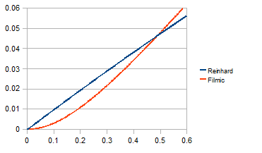

- [Document Link](#document-link)
- [SI 기본 단위](#si-기본-단위)
- [Radiometry](#radiometry)
- [Photometric Units](#photometric-units)
  - [Luminance vs Luma](#luminance-vs-luma)
- [Tone Mapping](#tone-mapping)
- [Gamma Correction](#gamma-correction)

---


## Light

  - 그래픽스 하위 문서. 라이트 관련 정보들을 저장해놓는 문서


---
# Document Link

  - ## [Graphics Study](Graphics.md)


---
# [SI 기본 단위](https://ko.wikipedia.org/wiki/%EA%B5%AD%EC%A0%9C%EB%8B%A8%EC%9C%84%EA%B3%84)

  - 세계적으로 가장 널리 사용되는 국제 표준 도량형
  - 프랑스어 `Le Système International d'Unités` 에서 유래됨
  - 7개의 기본단위와 이들로 유도되는 22개의 이름을 가진 유도단위, 단순히 기본 단위가 조합된 일반 유도 단위들을 요소로 갖는다.
  - 기본단위

| 단위 이름 | 단위 기호 | 물리량 이름 | 물리량 기호 | 차원 기호 | 
|:---:|:---:|:---:|:---:|:---:|
| 초 | ${\rm s}$ | 시간 | $l$ | $\textsf{T}$ | 
| 미터 | ${\rm m}$ | 길이 | $m$ | $\textsf{L}$ | 
| 킬로그램 | ${\rm kg}$ | 질량 | $t$ | $\textsf{M}$ | 
| 암페어 | ${\rm A}$ | 전류 | $I$ | $\textsf{I}$ | 
| 켈빈 | ${\rm K}$ | 온도 | $T$ | $\Theta$ | 
| 몰 | ${\rm mol}$ | 물질량 | $n$ | $\textsf{N}$ | 
| 칸델라 | ${\rm cd}$ | 광도 | $I_v$ | $\textsf{J}$ | 

  - 유도 단위 (필요한 것만 작성, 나머지는 위키 참조)
  
| 단위 이름 | 단위 기호 | 물리량 이름 | SI 기본 단위 | 차원 |
|:---:|:---:|:---:|:---:|:---:|
| 라디안 | ${\rm rad}$  | 평면각 | ${\rm m \cdot m^{-1}}$ | $\textsf{1}$ |

---
# [Radiometry](https://en.wikipedia.org/wiki/Radiometry)

  - 전자기파의 복사(Electromagnetic Radiation)를 측정하는 일련의 기술
  - ### 복사(Radiation)
    - 0($K$)이상 온도의 모든 물체는, 전자기 복사선


  - 참고
    - [복사와 방사의 차이](https://m.blog.naver.com/PostView.naver?isHttpsRedirect=true&blogId=kore2758_&logNo=221415392684)


---
# Photometric Units
 
  - ### BRDF (Bidirectional Reflection Distribution Function, 양방향 반사 분포 함수)
    - 표면이 반사하는 빛의 양을 평가하는 데 쓰이는 함수 (수학 공식)
    - 일반적으로 빛의 속성과 표면의 재질 속성, 시점 또는 카메라의 위치를 포함한 여러 개의 입력 매개변수들을 사용한다.
    - `블린-퐁(Blinn-Phong)` 모델의 BRDF를 기본값으로 자주 사용한다.

## Luminance vs Luma

  - `Luminance(휘도)`
    - 어떤 방향으로 이동하는 빛의 단위 면적당 광도
    - 빛의 강도에 대한 물리적 측정이며, 단위는 평방미터 당 칸델라이다. $(cd/m^2)$
      - 광도(Luminous Intensity) : 광원에서 특정 방향으로 나오는 가시광의 강도 (칸델라, $cd, \frac{lm}{sr}$)
 
      - 광속(Luminous Power) : 광원으로부터 나오는 가시광의 총량 (루멘, $lm$)
      - 조도(Illuminance) : 물체의 단위 면적에 들어오는 빛의 양 (룩스, $lx, \frac{lm}{m^2}$)
      - 휘도(Luminance) : 광원으로부터 복사되는 빛의 밝기 (니트, $nt, \frac{cd}{m^2}$) [위키](https://ko.wikipedia.org/wiki/%ED%9C%98%EB%8F%84)
      - 광효율(Luminous Efficacy) : 단위전력당 방출되는 광량 (루멘 퍼 와트, $\frac{lm}{W}$)

  - `Relative Luminance(상대 휘도)`
    - 사람이 무언가를 얼마나 밝게 보는지를 측정하는 단일 스칼라 값
    - `CIE standard`가 `표준 관찰자`를 정의하며, 0 ~ 1 또는 0 ~ 100의 정규화된 범위를 가진다. (높은 값이 reference white)
    - 우리는 초록색이 파란색보다 좀 더 밝다고 느낀다.
    - 때문에 기존 RGB-Triple의 값을 그대로 사용하면 우리가 인식하는 것과 약간 다른 색상이 나온다.
    - $Y=0.2126R+0.7152G+0.0722B$
      - `CIE Yxy 색표계`의 Y값이 휘도와 동일하다고 하는데 더 알아볼 필요가 있다.
    - 휘도를 사용하는 톤매핑 연산자는 RGB 채널을 휘도로 변환 후 매핑을 하고, 결과값을 새 휘도값으로 스케일링 한다.
      - 라인하르트 말고 다른 톤매핑에서는 그냥 상수값으로 조절하더라..
  - `Luma`
    - 감마 압축 비디오 신호에서 수행되는 상대 휘도 계산
    - == `감마 보정된 RGB` 성분의 가중치 합
    - 실제 광원을 가지고 이미지 센서를 가리키면, 센서는 $R'G'B'$ 값을 출력한다. 프라임 == 감마 컴프레션
    - $Y'=0.2126R'+0.7152G'+0.0722B'$

  

  - 참고
    - https://cs.stackexchange.com/questions/92569/what-is-the-difference-between-luma-and-luminance
    - [아트세미텍 ppt - LED 광 측정 단위](https://slidesplayer.org/slide/12638978/)

  

  

  


---
# Tone Mapping

  - 이미지의 전체 밝기와 대비(contrast)를 조정하고 출력 장치에 맞게 이미지의 색상 범위를 줄이는 데 사용되는 기술
  - `HDR`을 사용할 때 반드시 필요하다.
  - `감마 보정`되지 않은 선형성의 색상을 가지고 연산을 진행해야 정확한 값이 나온다. -> 출력 시 감마 인코딩을 해야 한다.

  - ### Reinhard's Operator (라인하르트의 연산자)
    - 가장 간단하고 널리 쓰이는 연산자이다.
    - [자세한 내용은 여기서 참고](https://expf.wordpress.com/2010/05/04/reinhards_tone_mapping_operator/)
    - 가장 밝은 지역을 없애기 위해 상한값을 지정하는 수정 버전도 있다.
    - 라인하르트 연산자는 휘도를 사용하는 연산자이기 때문에 정확한 연산을 하려면 RGB값을 휘도로 변경할 필요가 있다.


  $$
\begin {aligned} 
TMO(C) &= \frac{C}{1 + C(x,y)} \\
TMO_{ext}(C) &= \frac{C * (1 + \frac{C}{C^2_{white}})}{1 + C} \quad C_{white} = cutoff\ parameter
\end {aligned} 
  $$

  - ### Reinhard's Operator (Luminance Tone Map)
    - 기존 수정된 라인하르트 연산자에 rgb값 대신 휘도를 넣어서 계산하는 방식
$$
\begin {aligned} 
  TMO_{extlum}(C) &= C\ \frac{L_d(x,y)}{L(x,y)} \quad C = RGB \\
L_d(x,y) &= \frac{L(x,y) (1 + \frac{L(x,y)}{L^2_{white}})}{1 + L(x,y)} \quad L_{white} = cutoff\ parameter
\end {aligned} 
$$

```cpp
float GetLuminance(float3 rgb) {
	return dot(rgb, float3(0.2126f, 0.7152f, 0.0722f));
}

float3 ReinhardLuminance(float3 hdr, float averageLum, float middleGray, float cutoffWhite) {
	float lum = GetLuminance(hdr);
	lum *= middleGray / averageLum;	// middleGray ~~ camera exposure configuration
	float lumOut = (lum * (1.0f + (lum / (cutoffWhite * cutoffWhite)))) / (1.0f + lum);
	return hdr * (lumOut / lum);
}
```

  - ### Filmic Tone Mapping Operator
    - 말 그대로 영화처럼 보이게 만들어주는 톤 매핑
    - Radiance(X축)-Brightness(Y축) 그래프에서 라인하르트 연산자와 비교했을 때, 끝 부분 (toe, shoulder)이 굴곡진다.
    - 감마 보정이 필요 없도록 조정된(Baked) 연산자도 있다.



  - ### [Uncharted2](https://www.gdcvault.com/play/1012351/Uncharted-2-HDR)
    - John Hable이 Uncharted2 HDR Lighting 발표 문서에서 소개한 내용
    - 최초 버전은 감마 보정 불필요, 수정된 버전은 감마 보정 필요

```cpp
// 감마값이 포함된 톤맵핑. John Hable이 발표함
float3 ToneMapFilmicALU(in float3 color) {
	color = max(0, color - 0.004f);
	color = (color * (6.2f * color + 0.5f)) / (color * (6.2f * color + 1.7f) + 0.06f);
	return color;
}

float3 ToneMapUncharted2Partial(float3 x) {
	float A = 0.15f;	// Shoulder Strength
	float B = 0.50f;	// Linear Strength
	float C = 0.10f;	// Linaer Angle
	float D = 0.20f;	// Toe Strength
	float E = 0.02f;	// Toe Numerator
	float F = 0.30f;	// Toe Denominator
	return ((x * (A * x + C * B) + D * E) / (x * (A * x + B) + D * F)) - E / F;
}
float3 ToneMapUncharted2(float3 col) {
	float exposureBias = 2.0f;
	float3 curr = ToneMapUncharted2Partial(col * exposureBias);

	float W = 11.2f;	// Linear White Point Value
	float3 whiteScale = 1.0f / ToneMapUncharted2Partial(W);
	return curr * whiteScale;
}
```

  - ### ACES (Academy Color Encoding System)
    - `영화 예술 과학 아카데미(Academy of Motion Picture Arts and Sciences)`의 후원 하에 개발된 무료 개방형 장치 독립형 색상 관리 및 이미지 교환 시스템
    - 색 공간을 표준화하기 위해 만들어졌으며 넓은 색 공간을 사용하기 때문에 사실적이다.
    - 언리얼 엔진4에서 사용하는 TMO이다.

```cpp
// sRGB => XYZ => D65_2_D60 => AP1 => RRT_SAT
static const float3x3 ACESInputMat = {
	{ 0.59719f, 0.35458f, 0.04823f },
	{ 0.07600f, 0.90834f, 0.01566f },
	{ 0.02840f, 0.13383f, 0.83777f }
};

// ODT_SAT => XYZ => D60_2_D65 => sRGB
static const float3x3 ACESOutputMat = {
	{ 1.60475f, -0.53108f, -0.07367f },
	{ -0.10208f, 1.10813f, -0.00605f },
	{ -0.00327f, -0.07276f, 1.07602f }
};
float3 RRTAndODTFit(float3 v) {
	float3 a = v * (v + 0.0245786f) - 0.000090537f;
	float3 b = v * (0.983729f * v + 0.4329510f) + 0.238081f;
	return a / b;
}
float3 ToneMapACESFitted(float3 color) {
	color = mul(ACESInputMat, color);

    // Apply RRT and ODT
	color = RRTAndODTFit(color);

	color = mul(ACESOutputMat, color);

    // Clamp to [0, 1]
	return saturate(color);
}
```

  - ### [ACES Approximate](https://knarkowicz.wordpress.com/2016/01/06/aces-filmic-tone-mapping-curve/)
    - `ACES` 연산 부하를 줄인 간단한 버전. 밝은 색상을 좀 더 강조(과포화)한다.

```cpp
float3 ToneMapACES(float3 x) {
	x *= 0.6f;
    // Narkowicz 2015, "ACES Filmic Tone Mapping Curve"
	const float a = 2.51f;
	const float b = 0.03f;
	const float c = 2.43f;
	const float d = 0.59f;
	const float e = 0.14f;
	
	return saturate((x * (a * x + b)) / (x * (c * x + d) + e));
}
```


  - 참고
    - https://64.github.io/tonemapping/
    - https://bruop.github.io/tonemapping/
    - [Reinhard's Tone-Mapping Operator](https://expf.wordpress.com/2010/05/04/reinhards_tone_mapping_operator/)


---
# Gamma Correction

  - ### Gamma : 픽셀의 숫자 값과 실제 광도 사이의 관계를 정의한다. 엄밀히 말하면 `센서나 표시장치와 같은 하드웨어 장치의 비선형성`을 의미한다.
    - 광자 수가 두 배로 늘어나면 카메라의 센서에 두 배의 신호가 수신된다. (선형 관계)
    - 우리 눈은 광자 수가 두 배로 늘어나면 **그보다 훨씬 더 밝다고 인식한다.** (비선형 관계) 밝기가 올라갈수록 그 차이는 점점 줄어든다.
    - 결론적으로, **우리 눈은 밝은 톤보다 어두운 톤에 더 민감하다**고 할 수 있다.
    - 카메라 센서와 눈의 인식 차이에서 발생하는 데이터상의 밝기값 손실을 방지하기 위해 디지털 이미지는 `감마 인코딩`을 한다.

    

  - ### Gamma Compression(감마 압축) : 선형 데이터를 파일 형식으로 압축하여 샘플당 비트 수를 줄이는 기술
    - Gamma Encoding 의 목적은 이미지를 디스플레이에 표시하기 위한 것이 아니라 `색상의 손실 없이 이미지를 기록하기 위한 것`이다.
    - 인코딩을 하지 않으면(실제 밝기 값을 우리 눈에 바로 적용하면) 어두운 톤의 부분(사람이 민감하게 인식하는)이 많이 사라지기 때문이다.
    - 감마 인코딩 값을 데이터로 가지는 색 공간을 **sRGB**라고 한다.
    - encode/decode 를 하드웨어에서 지원한다. 해당 형태로 저장된 이미지는 화면에 보여질 때 자동으로 감마 디코딩이 되어서 보여진다. 
  
  - ### sRGB : 마이크로소프트와 HP가 협력하여 만든 모니터 및 프린터 표준 RGB 색 공간.
  - `비공식적 표준 규격`이다. (대부분의 이미지는 해당 공간을 사용한다.)
  


- ### Linear Color Space : 수치적 강도 값이 사람이 인지하는 강도와 비례하여 일치하는 색 공간. 색상을 올바르게 추가하고 곱할 수 있다.

- 감마 인코딩 된 이미지는 정확한 수치의 강도를 저장한다. (사람 눈에는 밝게 보인다)
- 실제 이미지를 나타낼 때, 256레벨의 정보(8비트)만 있으면 충분히 부드럽게 이미지가 프린팅된다. 그러나 해당 정보량으로 linear encoding을 시도하면 `posterization` 현상이 발생한다.
  - posterization : 색과 색 사이의 중간값을 표현할 정보가 없어 이미지에서 색이 변경되는 곳이 명확하게 나뉘어지는 현상.
  - 여기서 설명하는 linear encoding이란, `카메라에 들어온 값을 그대로 이미지에 적는 것`이다.
  - 선형 인코딩을 사용할 때 posterization 현상을 피하려면 8배의 정보가 필요하다. (11비트)

- 우리가 정상적으로 인식하는 이미지의 감마 값을 1이라 할 때, **이미지에 저장되는 값들은 감마 인코딩을 거쳐서 저장된다. (gamma 0.45)** 이 경우 이미지는 `원래의 이미지보다 훨씬 밝아진다.`
- 감마 디코딩을 거치지 않은 데이터 정보 그대로를 표현한 이미지는 모니터로 출력될 때 예상했던 이미지보다 훨씬 어둡게 나온다.
  - 디스플레이에서 자동으로 우리 눈에 적합하게 디코딩을 하기 때문이다.
  - 이미지 보정 프로그램들의 컬러 픽커(색 편집)에서 `명도`조절을 해보면 확실해진다. 0.5에 해당하는 값은 실제 0.5의 색이 아닌 좀 더 진한 값($0.5^{2.2} == 0.217$)이 출력된다.

- ### Physically Based Rendering을 하려면 **선형 파이프 라인을 사용해야 한다.**
  - 정확한(실제 세상과 비슷한) 대비를 표현해야 하기 때문이다.


- 감마 인코딩을 하면 어두운 톤을 나타내는 비트가 늘어나는데 왜 이미지가 밝아지나?
  - 어두운 톤을 표현하기 위해 많은 비트를 할애하기 때문에 선형 인코딩과 비교했을 때 어두운 톤이 더 큰 데이터를 가진다.(0을 어두운 쪽이라 가정했을 때)
  - 감마 인코딩된 데이터 값을 선형 그래프로 그렸을 때, 그 값이 일반적인 계산값보다 크기 때문에 이미지가 더 밝게 보인다.

  - 참고
    - [UNDERSTANDING GAMMA CORRECTION](https://www.cambridgeincolour.com/tutorials/gamma-correction.htm)
    - [WHAT EVERY CODER SHOULD KNOW ABOUT GAMMA](https://blog.johnnovak.net/2016/09/21/what-every-coder-should-know-about-gamma/)
    - [LearnOpenGL - Gamma Correction](https://learnopengl.com/Advanced-Lighting/Gamma-Correction)