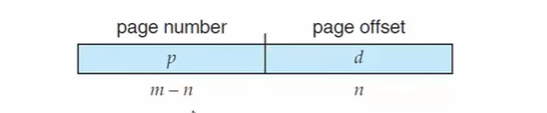

- [스택 프레임](#스택-프레임)
- [함수 호출 규약](#함수-호출-규약)
- [Locality](#locality)
- [메모리 단편화](#메모리-단편화)
  - [`페이징(Paging)` 기법](#페이징paging-기법)
- [정적 지역 변수(Static Local Variable) 원리](#정적-지역-변수static-local-variable-원리)

---

## Memory Management Strategy

  - 운영체제 내에서 메모리 시스템에 대한 전반적인 지식들을 모아놓은 문서

  - [new delete로 메모리 관리하기](https://blog.naver.com/PostView.naver?blogId=tipsware&logNo=221606898397&parentCategoryNo=&categoryNo=87&viewDate=&isShowPopularPosts=false&from=postView)

---
# [스택 프레임](https://eliez3r.github.io/post/2019/10/16/study-system.Stack-Frame.html)

  - 어떤 함수가 호출되었을 때 그 함수가 점유하는 메모리 블록

  - 스택 영역에서 호출된 함수를 구분하기 위한 공간이다.
  - 최초에 함수가 메모리에 호출되면 생성되며, 해당 스택 프레임의 함수가 종료될 때 함께 소멸된다.
  - 어셈블러 레지스터가 사용된다.
    - `EBP` : `베이스 포인터`, `프레임 포인터(FP)`, `로컬 베이스(LB) 포인터` 로도 불린다.
      - 현재 스택 프레임이 시작된 위치의 주소값을 가리킨다.
    
      - 고정값이기 때문에 지역변수, 매개변수의 참조 및 수정에 사용된다.
      - 함수가 시작할 때마다 생성되는 다른 레지스터들과는 달리 한개만 존재한다.
      - 함수가 실행될 때마다 이전 함수(caller)의 `EBP`값을 저장할 필요가 있기 때문에 스택에 저장한다.(`SFP`)
    - `ESP` : `스택 포인터`라고 하며, 현재 스택이 어디까지 쌓여있는지 가리킨다.(주소 상 가장 낮은 주소, top과 동일)

    - `EIP` : 다음에 실행될 메모리의 주소를 가리킨다.
  - 실제 스택 프레임은 `EBP`와 `ESP`사이의 공간라고 볼 수 있다.
  - 매개변수, 반환주소(RET), `SFP`(`Save Frame Pointer`), 지역변수, ... 순으로 스택에 저장된다.
    - `RET, return address` : 함수 호출 명령(`CALL`) 다음에 실행할 부분의 주소, 즉 함수 호출 시점의 `EIP` + 주소 크기
    - `SFP, Save Frame Pointer` : 이전 함수의 프레임 포인터(`EBP`). 호출된 함수를 끝내고 돌아갈 때 스택 프레임을 복원하기 위한 세이브 포인트.
  - ### `프롤로그` : 스택 프레임을 생성하기 위해 `EBP`를 스택에 저장하고 `ESP`값으로 변경하는 일련의 과정
    - 함수가 호출되면 일단 그 함수의 파라미터들이 먼저 스택에 쌓이고 그 뒤에 `CALL` 명령을 수행한다.

    - 스택에 반환주소(`RET`)와 이전 함수의 프레임 포인터(`SFP`)를 넣은 시점에서의 `ESP` 값이 현재 함수의 `EBP` 값이 된다.
    - 실제 코드
      - `PUSH EBP` : 이전 함수의 프레임 포인터(현재 `EBP`값)를 스택에 push한다.

      - `MOV EBP ESP` : `ESP`의 값을 `EBP`에 복사한다. (스택의 top과 bottom이 같은 값을 가진다.)
  - ### `에필로그` : 함수가 끝나고 `caller` 함수로 돌아갈 때 스택을 비우는 일련의 과정
    - `leave`, `ret` 2개의 명령어를 사용한다.
      - `leave` 명령어의 실제 코드는 `MOV ESP EBP`, `POP EBP` 이다.
        - `MOV ESP EBP` : `EBP`의 값을 `ESP`에 복사한다. (스택 내의 지역 변수를 버린다.)

        - `POP EBP` : 스택에 저장된 `SFP` 값을 pop 하여 `EBP` 에 넣는다.
      - `ret` 명령어의 실제 코드는 `POP EIP`, `JMP EIP` 이다.
        - `POP EIP` : 스택에 저장된 `RET` 값을 pop 하여 `EIP` 에 넣는다.

        - `JMP EIP` : `EIP`에 저장된 주소로 이동한다.
    - 이후 해당 함수에 매개변수가 있었다면, `caller` 함수에서 `ADD ESP ~` 명령어를 통해 스택에서 값을 제거한다.

  

  - https://foxtrotin.tistory.com/167
  - https://foxtrotin.tistory.com/262
  - https://hg2lee.tistory.com/entry/Stack-Fame

---
# 함수 호출 규약

  - https://phaphaya.tistory.com/24
  - https://plummmm.tistory.com/354
  

---
# Locality

  - CPU와 메모리 사이에서 데이터를 주고받는 행동(pipeline fetch)은 시간이 오래걸린다.
  - 이를 해결하기 위해 프로세서 안에 CPU와 메인 메모리 사이에 `캐시(임시 저장소)`를 추가했다.
    - CPU가 메인 메모리에 정보를 request 하면 메인 메모리는 캐시에 정보를 저장한다. CPU는 캐시의 정보를 사용한다.
    - 이후 CPU가 같은 정보를 request 하면 캐시에 있던 정보를 바로 사용한다.
  - 캐시는 메인 메모리보다 크기가 상당히 작다. 어떻게 정보를 저장하나?
  - 해당 정보만 저장하는 것이 아니라 해당 정보의 `가까운 주변 정보들`을 같이 저장한다.
  - `Locality` 는 두 가지 종류가 있다.
    - ### Temporal Locality(Locality in Time, 시간 지역성)
      - 동일한 데이터가 재사용될 가능성이 높은 경우 캐시에 저장
    - ### Spatial Locality(Locality in Space, 공간 지역성)
      - 한번 접근한 데이터의 주변 데이터들을 사용할 가능성이 높은 경우 캐시에 저장
      - 배열의 경우 여기에 해당한다.
  
  - TODO

  - 참고
    - https://wpaud16.tistory.com/225

---
# 메모리 단편화

  - `RAM`에서 메모리의 공간이 작은 조각으로 나뉘어져 사용가능한 메모리가 충분히 존재하지만 할당(사용)이 불가능한 상태를 보고 메모리 단편화가 발생했다고 한다.
  - `외부 단편화(External Fragmentation)`와 `내부 단편화(Internal Fragmentation)`로 나뉜다.
    - 외부 단편화 : 메모리가 할당되고 해제되는 작업이 반복될 때 생기는 사용하지 않는 작은 메모리들이 많이 존재해서 총 메모리 공간은 충분하지만 실제로 할당할 수 없는 상황
      - 동적할당으로 메모리를 여러번 할당-해제 할 경우 점유된 메모리 사이에 자잘한 공간이 생긴다. 크기가 작아 다른 프로세스에 사용하지 못함.
    - 내부 단편화 : 메모리를 할당할 때 프로세스가 필요한 양보다 더 큰 메모리가 할당되어서 프로세스에서 사용하는 메모리 공간이 낭비 되는 상황
      - 프로세스가 필요로 하는 메모리 크기와 메모리 할당 단위가 나누어 떨어지지 않아서 운영체제가 실제 필요한 메모리 양보다 크게 할당한 경우
        - 10kb 단위로만 할당할 수 있는 메모리에 105kb짜리 프로세스를 할당해야 하는 경우 5kb의 메모리를 사용할 수 없게 된다.
  - 해결 방법은 크게 3가지가 존재한다.

## `페이징(Paging)` 기법

  - 사용하지 않는 프레임을 페이지에 옮기고, 필요한 메모리를 페이지 단위로 프레임에 옮기는 기법
    - 페이지 : 가상 메모리(보조기억장치)를 일정한 크기의 블록으로 나눈 것
      - 최근 윈도우 운영체제는 모두 4096(4kb)의 페이지 크기를 사용한다.
    - 프레임 : 물리 메모리(RAM)을 일정한 크기의 블록으로 나눈 것
  - 페이지와 프레임을 대응시키기 위해 `page mapping`과정이 필요해 `page table`을 생성한다.
    - `페이지 테이블` : 프로세스의 페이지 정보를 저장하고 있는 테이블
      - 프로세스 당 하나의 페이지 테이블을 가진다.
      - 색인(페이지 번호), 내용(해당 페이지에 프레임의 시작주소)로 구성되어 있다.
        - 논리 주소 공간의 크기가 2^m이고, 페이지의 크기가 2^n일 때 상위 (m - n) 비트는 페이지 번호, 하위 n 비트는 오프셋이다.

  - 연속적이지 않은 공간을 활용할 수 있기 때문에 외부 단편화 문제를 해결할 수 있다.
  - 페이지 단위에 맞게 꽉 채워 쓰는 것이 아니기 때문에 내부 단편화 문제는 해결할 수 없다.

  - https://goodmilktea.tistory.com/35?category=816729
  - https://jhnyang.tistory.com/290
  - https://sisru4070.tistory.com/66?category=566152
  - https://jeong-pro.tistory.com/91
  - http://egloos.zum.com/sweeper/v/2988689

  - 프로그램 실행 과정
    - https://com24everyday.tistory.com/288
    - https://hongku.tistory.com/182

  - 스택
    - https://sisru4070.tistory.com/67

  - 프로세스와 스레드
    - https://yeonduing.tistory.com/59 

  - 운영체제 공부 블로그
    - https://jhnyang.tistory.com/notice/31
    - https://goodmilktea.tistory.com/30?category=816729
    - https://m.blog.naver.com/ya3344/221238418657

---
# [정적 지역 변수(Static Local Variable) 원리](https://dataonair.or.kr/db-tech-reference/d-lounge/technical-data/?mod=document&uid=235959)