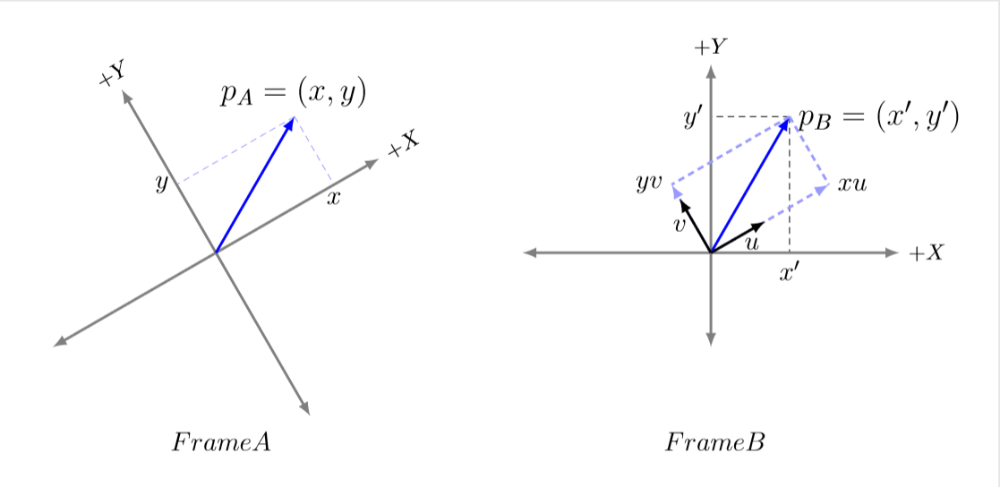
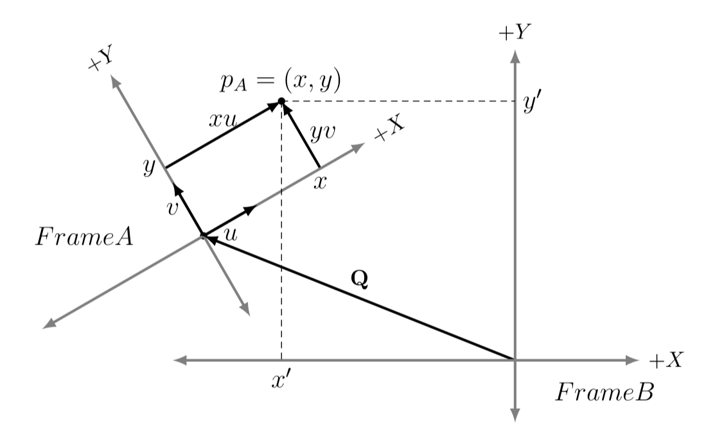
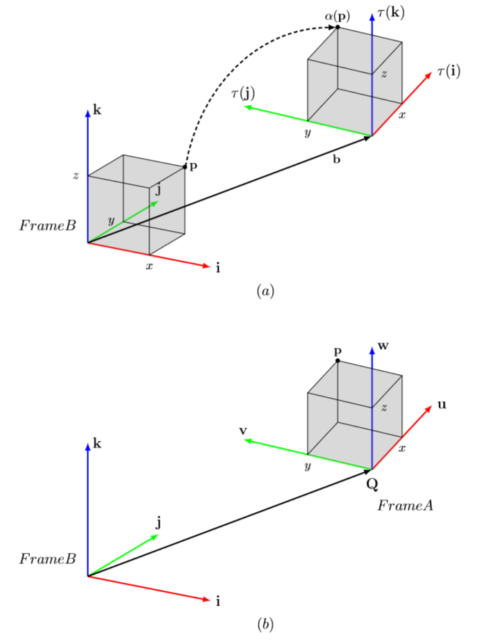
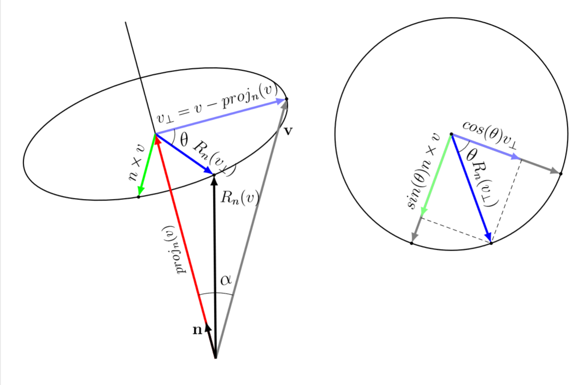

- [선형변환](#선형변환)
- [아핀변환](#아핀변환)
- [변환의 합성](#변환의-합성)
- [좌표계의 변경](#좌표계의-변경)
- [좌표 변환과 좌표계의 변경](#좌표-변환과-좌표계의-변경)
- [비례 선형변환 증명](#비례-선형변환-증명)
- [회전 선형변환 증명](#회전-선형변환-증명)
- [Latex 소스코드](#latex-소스코드)
  - [coor\_vector.png](#coor_vectorpng)
  - [coor\_dot.png](#coor_dotpng)
  - [equivalence.png (좌표계 변환)](#equivalencepng-좌표계-변환)
  - [rotation.png (회전 선형변환 증명)](#rotationpng-회전-선형변환-증명)


# 선형변환

  - ### 변환을 의미하는 함수를 $\tau$ 라고 했을 때 그 함수가 다음과 같은 두가지 성질을 만족하면 `선형변환`이라고 한다. 
    - $u$, $v$ 는 벡터이고 $k$ 는 스칼라이다.

    [//]: 

$$
\begin{aligned} 
\tau(\textbf u + \textbf v) &= \tau(\textbf u) + \tau(\textbf v) \\
\tau(k\textbf u)  &= k\tau(\textbf u) \\
\end{aligned}
$$

  - 컴퓨터로 선형변환을 구현하기 위해서는 행렬의 곱연산이 필요하다. 그리고 그 행렬은 다음과 같이 제작한다.

  1. $u = (x,\ y,\ z)$ 라 할 때 좌표축을 나타내는 벡터 $\textbf i,\ \textbf j,\ \textbf k$ 를 이용하여 벡터를 분해할 수 있다.
  2. 벡터 $\textbf i,\ \textbf j,\ \textbf k$ 는 삼차원 공간에서 $x,\ y,\ z$ 축과 같은 방향의 단위벡터로 **표준기저벡터(standard basis vector)** 라고 부른다.

  [//]: 

$$
\begin{aligned}
u &= (x,\ y,\ z) \\
  &= x\textbf i + y\textbf j + z\textbf k \\
  &= x(1,\ 0,\ 0) + y(0,\ 1,\ 0) + z(0,\ 0,\ 1)
\end{aligned}
$$

  3. 선형변환 $\tau$ 에 벡터 $u$ 를 입력으로 하면 다음과 같이 식을 전개할 수 있다. 결국 선형변환은 행렬 $A$ 의 곱셈연산으로 표현 가능하다.

[//]: 

$$
\begin{aligned}
\tau(\textbf u) &= \tau(x\textbf i + y\textbf j + z\textbf k) \\
        &= x\tau(\textbf i) + y\tau(\textbf j) + z\tau(\textbf k) \\
        &= \textbf{uA} \\
        &= [x,\ y,\ z] \begin{bmatrix} 
                    \leftarrow \tau(\textbf i) \rightarrow \\
                    \leftarrow \tau(\textbf j) \rightarrow \\
                    \leftarrow \tau(\textbf k) \rightarrow 
                   \end{bmatrix} \\
        &= [x,\ y,\ z] \begin{bmatrix} 
                    A_{11} & A_{12} & A_{13} \\
                    A_{21} & A_{22} & A_{23} \\
                    A_{31} & A_{32} & A_{33}
                   \end{bmatrix} \\
\end{aligned}
$$

[//]: # ()

  - 벡터 $u$ 에 행렬 $S$ 를 곱셈하면 비례를 표현할 수 있다.

[//]: 

$$
\begin{aligned} 
\tau (\textbf u) &= \textbf{uS} \\
         &= [x,\ y,\ z] \begin{bmatrix}
                       s_{x} & 0 & 0 \\ 
                       0 & s_{y} & 0 \\ 
                       0 & 0 & s_{z}
                      \end{bmatrix} \\
         &= (s_{x}x,\ s_{y}y,\ s_{z}z) \\
\end{aligned}
$$

  - 벡터 $u$ 에 행렬 $R_{x}$ 을 곱셈하면 $x$ 축을 기준으로 한 회전을 표현할 수 있다.
  - $R_{y}$ 을 곱셈하면 $y$ 축을 기준으로 한 회전을 표현할 수 있다.
  - $R_{z}$ 을 곱셈하면 $z$ 축을 기준으로 한 회전을 표현할 수 있다.

[//]: 

$$
\begin{aligned}
R_{x} &= \begin{bmatrix}
          1 & 0 & 0 \\ 
          0 & cos\theta & sin\theta \\ 
          0 & -sin\theta & cos\theta
         \end{bmatrix} \\
R_{y} &= \begin{bmatrix}
          cos\theta & 0 & -sin\theta \\ 
          0 & 1 & 0 \\ 
          sin\theta & 0 & cos\theta
         \end{bmatrix} \\
R_{z} &= \begin{bmatrix}
          cos\theta & sin\theta & 0 \\ 
          -sin\theta & cos\theta & 0 \\ 
          0 & 0 & 1
         \end{bmatrix}
\end{aligned}
$$

# 아핀변환

  - ### `아핀변환(Affine Transformation)`은 선형변환(Linear Transformation)에 위치변환(Translation)을 추가한 변환이다.
    - `선형변환`으로 표현하지 못하는 것들을 동일한 방법으로 처리하기 위해서 나온 변환이다.

  - 위치와 무관하게 방향과 크기만을 가지는 `벡터`는 위치변환의 영향을 받지 않는다. 따라서 위치변환은 `점`만 해당된다.
  - `벡터`와 `점`을 동일한 형태로 다루기 위해 **동차좌표(homogeneous coordinates)** 라는 것을 사용한다.
    - 3D 공간에서 동차좌표는 하나의 원소를 추가하여 표현한다.
    - $(x, y, z, 0)$ 은 `벡터`를 의미하고 $(x, y, z, 1)$ 은 `점`을 의미한다.

  - 아핀변환 $\alpha$는 선형변환행렬 $A$, 이동변환벡터 $b$ 를 이용하여 표현할 수 있다.

[//]: 

$$
\begin{aligned} 
\alpha(u) &= \tau(u) + b \\
\alpha(u) &= uA+b \\
          &= [x,\ y,\ z] \begin{bmatrix} 
                       A_{11} & A_{12} & A_{13} \\
                       A_{21} & A_{22} & A_{23} \\
                       A_{31} & A_{32} & A_{33} \\
                      \end{bmatrix}
                      + [b_{x},\ b_{y},\ b_{z}] \\
          &= [x',\ y',\ z'] \\
\end{aligned} 
$$

  - 앞서 언급한 수식에 동차좌표가 도입되면 $u$ 는 `벡터`와 `점` 모두 표현이 가능하다.
  
  - 아래 식의 4 x 4 행렬을 **아핀변환 $\alpha$ 의 행렬 표현**이라고 부른다.
    - 보통 **변환 행렬** 으로 표현한다.

[//]: 

$$
\left[ x,\ y,\ z,\ 1 \right] 
  \begin{bmatrix}
   A_{11} & A_{12} & A_{13} & 0 \\ 
   A_{21} & A_{22} & A_{23} & 0 \\ 
   A_{31} & A_{32} & A_{33} & 0 \\ 
   b_{x} & b_{y} & b_{z} & 1
  \end{bmatrix}  = [x',\ y',\ z',\ 1]
$$

  - $\therefore$ 아핀변환 $\alpha$를 선형변환 $\tau$ 와 벡터 $b$ 를 이용하여 다음과 같이 표현할 수 있다.
    - 아핀변환 $\alpha$ 는 기저벡터 $i,\ j,\ k$ 를 `선형변환`하고 벡터 $b$ 를 `덧셈연산`한 것과 같음을 알 수 있다.

[//]: 

$$
\begin{aligned}
\alpha(x,\ y,\ z) 
  &= \tau(x,\ y,\ z) + \textbf b \\
  &= x\tau(\textbf i) + y\tau(\textbf j) + z\tau(\textbf k) + \textbf b \\
  &= \begin{bmatrix}
      x, & y, & z, & w
     \end{bmatrix} 
     \begin{bmatrix}
      \leftarrow \tau(\textbf i) \rightarrow \\
      \leftarrow \tau(\textbf i) \rightarrow \\
      \leftarrow \tau(\textbf i) \rightarrow \\
      \leftarrow \textbf b \rightarrow \\
     \end{bmatrix} \\
  &= \begin{bmatrix}
       {x}', & {y}', & {z}', & {w}'
     \end{bmatrix} 
\end{aligned}
$$

# 변환의 합성

  - 행렬 $S$ 는 스케일링변환, 행렬 $R$ 는 회전변환, 행렬 $T$ 는 이동변환을 의미한다고 하자. 
  - 8개의 버텍스로 구성된 큐브를 앞서 언급한 세가지 행렬을 곱셈연산하여 변환을 다음과 같이 구현할 수 있다.

[//]: 

$$
\begin{aligned}
((v_{i}S)R)T &= ({v_{i}}'R)T \\
             &= {v_{i}}''T \\
             &= {v_{i}}'''
\end{aligned}
$$

  - 위의 식을 잘 살펴보면 $SRT$ 를 미리 구해놓고 이것을 행렬 $C$ 라고 하면 행렬의 곱셈연산이 줄어들기 때문에 성능을 향상시킬 수 있다.

[//]: 

$$
\begin{aligned}
v_{i}(SRT) &= v_{i}C \\
           &= {v_{i}}'''
\end{aligned}
$$

# 좌표계의 변경

  - 우리는 주로 섭씨 온도를 사용한다. 예를 들어 섭씨 온도 $100^{\circ}$ 를 화씨 온도로 변환 하려면 어떻게 해야할까? 바로 다음과 같은 식을 이용하면 된다.

[//]: 

$$
\begin {aligned} 
T_{F} &= \frac{9}{5} T_{c} + 32^{\circ} \\
      &= \frac{9}{5} (100^{\circ}) + 32^{\circ}
      &= 212^{\circ}F
\end{aligned}
$$

  - 유사한 방법으로 3D 공간의 벡터 혹은 점을 다른 좌표계에서 표현할 수 있다.
  - 한 좌표계의 좌표를 다른 좌표계의 좌표로 변환하는 것을 `좌표 변경 변환(change of coordinate transformation)`이라고 한다.
  - 기하구조 자체를 변경하는 것이 아니기 때문에 **기존 변환과 대조적**이다.

  - $\therefore$ 좌표계 $A$ 에 상대적인 점 또는 벡터의 좌표를 좌표계 $B$ 에 상대적인 좌표로 변경하기 위해서는 **$B$ 좌표계로 표현한(상대적인) $A$ 좌표계의 기저벡터**가 필요하다.
  
  - 증명
  
예를 들어 2D 공간에서 $A$ 좌표계를 기준으로 한 좌표 $P_A(x,\ y)$ 를 $B$ 좌표계를 기준으로 한 좌표 $P_B({x}',\ {y}')$ 으로 표현해보자.



위의 그림은 두 좌표계 $A$와 $B$, 그리고 벡터 $p$가 있을 때 좌표계 $B$에 상대적인 $p$의 좌표를 도식으로 보여주고 있다. 

$P_{A}$ 를 $A$ 좌표계의 기저벡터 $\textbf u_{A},\ \textbf v_{A}$ 를 이용하여 다음과 같이 표현할 수 있다.

[//]: 

$$
\begin {aligned} 
\textbf P_{A} = x \textbf u_{A} + y \textbf v_{A}
\end{aligned}
$$

$B$ 좌표계를 기준으로 하는 좌표 $P_{B}$ 또한 **$B$ 좌표계로 표현한 $A$ 좌표계의 기저벡터** $\textbf u_{B},\ \textbf v_{B}$ 를 이용하여 다음과 같이 표현할 수 있다.

[//]: 

$$
\begin {aligned} 
\textbf P_{B} = x \textbf u_{B} + y \textbf v_{B}
\end{aligned}
$$

지금까지 2D 를 기준으로 설명한 것을 3D 를 기준으로 다음과 같이 확장할 수 있다.

[//]: 

$$
\begin {aligned} 
\textbf P_{B} = x \textbf u_{B} + y \textbf v_{B} + z \textbf w_{B}
\end{aligned}
$$

점의 경우는 다음과 같이 이동변환을 추가하여 이해할 수 있다.

[//]: 

$$
\begin {aligned} 
\textbf P_{B} = x \textbf u_{B} + y \textbf v_{B} + z \textbf w_{B} + \textbf Q_{B}
\end{aligned}
$$

$\textbf Q_{B}$ 는 $B$ 좌표계로 표현한 $A$ 좌표계의 원점이다.




좌표계의 변환도 `동차좌표`를 사용하여 벡터와 점을 처리하는 하나의 공식으로 만들 수 있으며, 행렬로 표현할 수 있다.

[//]: 

$$
\begin {aligned} 
(x',\ y',\ z',\ w)
  &= [x,\ y,\ z,\ w]
     \begin{bmatrix}
      \leftarrow \textbf u_{B} \rightarrow \\
      \leftarrow \textbf v_{B} \rightarrow \\
      \leftarrow \textbf w_{B} \rightarrow \\
      \leftarrow \textbf Q_{B} \rightarrow \\
     \end{bmatrix} \\
\left[x',\ y',\ z',\ w\right] 
  &= [x,\ y,\ z,\ w]
   \begin{bmatrix}
    u_{x} & u_{y} & u_{z} & 0\\ 
    v_{x} & v_{y} & v_{z} & 0\\ 
    w_{x} & w_{y} & w_{z} & 0\\ 
    Q_{x} & Q_{y} & Q_{z} & 1
   \end{bmatrix} \\
  &= x \textbf u_{B} + y \textbf v_{B} + z \textbf w_{B} + w \textbf Q_{B}
\end{aligned}
$$

여기서 $\textbf Q_{B} = (Q_{x},\ Q_{y},\ Q_{z},\ 1)$, 
$\textbf u_{B} = (u_{x},\ u_{y},\ u_{z},\ 0)$,
$\textbf v_{B} = (v_{x},\ v_{y},\ v_{z},\ 0)$,
$\textbf w_{B} = (w_{x},\ w_{y},\ w_{z},\ 0)$ 은 
좌표계 $A$ 의 원점과 축들의 $B$ 기준 `동차좌표`들이다.
  
이 때, $A$ 기준 좌표들을 $B$ 기준 좌표들로 변환(convert, = 사상한다(mapping))하는 4x4 행렬을 
`좌표 변경 행렬(change of coordinate matrix)` 또는 
`좌표계 변환 행렬(change of frame matrix)`라고 부른다.

$\therefore$ 좌표계 $A$ 에 상대적인 점 또는 벡터의 좌표를 좌표계 $B$ 에 상대적인 좌표로 변경하기 위해서는 **$B$ 좌표계로 표현한(상대적인) $A$ 좌표계의 기저벡터**가 필요하다.


# 좌표 변환과 좌표계의 변경

  - 특정좌표 $x,\ y,\ z$ 를 아핀변환한 것은 다음과 같다.

[//]: 

$$
\begin{aligned}
\alpha(x,\ y,\ z) 
  &= \tau(x,\ y,\ z) + \textbf b \\
  &= x\tau(\textbf i) + y\tau(\textbf j) + z\tau(\textbf k) + \textbf b \\
  &= \begin{bmatrix}
      x, & y, & z, & w
     \end{bmatrix} 
     \begin{bmatrix}
      \leftarrow \tau(\textbf i) \rightarrow \\
      \leftarrow \tau(\textbf i) \rightarrow \\
      \leftarrow \tau(\textbf i) \rightarrow \\
      \leftarrow \textbf b \rightarrow \\
     \end{bmatrix} \\
  &= \begin{bmatrix}
       {x}', & {y}', & {z}', & {w}'
     \end{bmatrix} 
\end{aligned}
$$

  - 특정좌표 $x,\ y,\ z$ 의 좌표계를 변경한 것은 다음과 같다.

[//]: 

$$
\begin {aligned} 
(x',\ y',\ z',\ w)
  &= [x,\ y,\ z,\ w]
     \begin{bmatrix}
      \leftarrow \textbf u_{B} \rightarrow \\
      \leftarrow \textbf v_{B} \rightarrow \\
      \leftarrow \textbf w_{B} \rightarrow \\
      \leftarrow \textbf Q_{B} \rightarrow \\
     \end{bmatrix} \\
\left[x',\ y',\ z',\ w\right] 
  &= [x,\ y,\ z,\ w]
   \begin{bmatrix}
    u_{x} & u_{y} & u_{z} & 0\\ 
    v_{x} & v_{y} & v_{z} & 0\\ 
    w_{x} & w_{y} & w_{z} & 0\\ 
    Q_{x} & Q_{y} & Q_{z} & 1
   \end{bmatrix} \\
  &= x \textbf u_{B} + y \textbf v_{B} + z \textbf w_{B} + w \textbf Q_{B}
\end{aligned}
$$

  - ### $\therefore$ 좌표 변환('능동적' 변환, 비례, 회전, 이동)과 좌표계를 변경(좌표 변경 변환)하는 것은 **수학적으로 동등하다. ('동치'관계, equivalence)**
    - 능동적 변환을 좌표 변경 변환으로 해석하는 것이 가능하며, 그 역도 마찬가지이다.



  - $(a)$에서는 하나의 좌표계 $B$를 기준으로 아핀변환을 적용해서 입방체의 위치와 방향을 변경한다.
    - $\alpha(x,\ y,\ z,\ w) = x \tau(\textbf i) + y \tau(\textbf j) + z \tau(\textbf k) + w \textbf b$
  
  - $(b)$에서는 $A$와 $B$라는 두 개의 좌표계를 사용하여 $A$에 상대적인 입방체 점들의 좌표를 $B$에 상대적인 좌표들로 변환한다. 
    - $\textbf p_{B} = x \textbf u_{B} + y \textbf v_{B} + z \textbf w_{B} + w \textbf Q_{B}$
  
  - 두 경우 모두 좌표계 $B$를 기준으로 $\alpha(p) = (x',\ y',\ z',\ w) = p_{B}$ 가 성립한다.
    - $(b)$ 의 좌표계 변경 행렬은 $(a)$ 의 변환 행렬과 동일하다.

  - 여러 개의 좌표들을 다루면서 좌표계만 변경하는 경우와 $(b)$ 하나의 좌표계에서 물체의 좌표를 변환하는 경우 $(a)$ 둘 중 편한 방법을 선택하면 된다.


# 비례 선형변환 증명

  - 비례변환은 다음 그림의 식을 통해 선형변환의 성질을 만족한다는 것을 확인할 수 있다.

[//]: 

$$
\begin {aligned} 
S(\textbf u + \textbf v) 
  &= (s_{x}(u_{x} + v_{x}),\ s_{y}(u_{y} + v_{y}),\ s_{z}(u_{z} + v_{z})) \\
  &= (s_{x}u_{x} + s_{x}v_{x},\ s_{y}u_{y} + s_{y}v_{y},\ s_{z}u_{z} + s_{z}v_{z}) \\
  &= (s_{x}u_{x},\ s_{y}u_{y},\ s_{z}u_{z}) + (s_{x}v_{x},\ s_{y}v_{y},\ s_{z}v_{z}) \\
  &= S(\textbf u) + S(\textbf v) \\
\\
S(k\textbf u) &= (s_{x}k\, u_{x},\ s_{y}k\, u_{y},\ s_{z}k\, u_{z}) \\
      &= k(s_{x}u_{x},\ s_{y}u_{y},\ s_{z}u_{z}) \\
      &= kS(\textbf u) \\
\end{aligned}
$$

  - 비례변환에 표준기저벡터를 곱하면 각 축에 해당하는 원소의 크기를 변경하는 비례행렬을 얻을 수 있다.

[//]: 

$$
\begin{aligned}
S(\textbf i) &= (s_{x}\cdot 1,\ s_{y}\cdot 0,\ s_{z}\cdot 0) = (s_{x},\ 0,\ 0) \\
S(\textbf j) &= (s_{x}\cdot 0,\ s_{y}\cdot 1,\ s_{z}\cdot 0) = (0,\ s_{y},\ 0) \\
S(\textbf k) &= (s_{x}\cdot 0,\ s_{y}\cdot 0,\ s_{z}\cdot 1) = (0,\ 0,\ s_{z}) \\
S &= \begin{bmatrix}
      _{x} & 0 & 0\\ 
      0 & s_{y} & 0\\ 
      0 &  0 & s_{z}
     \end{bmatrix}
\end{aligned}
$$

  - 비례변환의 행렬 S는 `비례 행렬(scaling matrix)`이라고 부른다. 

  - $s_{x}$ 는 $x$ 축의 비율을, $s_{y}$ 는 $y$ 축의 비율을, $s_{z}$ 는 $z$ 축의 비율을 조절한다.


# 회전 선형변환 증명

  - 벡터 $\textbf v$ 를 축 $\textbf n$ 에 대해 회전하는 변환을 표현하기 위해서는 복잡한 식의 계산이 필요하다.



(위의 그림에서 회전각은 $\textbf n$ 을 내려다 볼 때(머리->꼬리) `시계방향`으로 측정하며, $\textbf n$ 의 크기는 `1`이라고 가정한다.)

  - 먼저, 벡터 $\textbf v$ 를 축 $\textbf n$ 에 평행한 정사영 벡터 $proj_{\textbf n}(\textbf v)$ 와 $\textbf n$ 에 수직인 벡터 $\textbf v_{\perp}$ 로 쪼갠다. 
    - 정사영 벡터는 $\textbf n$ 과 평행하기 때문에 $\textbf v_{\perp}$ 의 회전방법만 알아내면 회전 후의 $\textbf v$ 를 알아낼 수 있다.

  - $R_{n}(\textbf v_{\perp})$ 를 알아내기 위해서 $\textbf n$ 과 $\textbf v_{\perp}$ 에 수직인 벡터 $\textbf n \times \textbf v$(외적) 를 구한다. 
$\textbf n \times \textbf v$ 의 크기는 다음과 같은 공식으로 $\textbf v_{\perp}$ 와 크기가 같다는 것을 알 수 있다.

[//]: 

$$
\begin {aligned} 
\left\| \textbf n \times \textbf v \right\| 
  &= \left\| \textbf n \right\| \left\| \textbf v \right\| sin\alpha \\
  &= \left\| \textbf v \right\| sin\alpha \\
  &= \left\| \textbf v_{\perp} \right\|
\end{aligned}
$$

  - $\textbf v_{\perp}$ 와 $\textbf n \times \textbf v$ 두 개의 벡터를 통해 $R_{n}(\textbf v_{\perp})$ 를 구할 수 있다.

[//]: 

$$
R_{n}(\textbf v_{\perp}) = cos\theta \, \textbf v_{\perp} + sin\theta \, (\textbf n \times \textbf v)
$$

  - 이를 통해 다음과 같은 공식을 이끌어낼 수 있다.

[//]: 

$$
\begin {aligned} 
R_{n}(\textbf v) 
  &= proj_{n}(\textbf v) + R_{n}(\textbf v_{\perp}) \\
  &= (\textbf n\cdot \textbf v)n + cos\theta \, \textbf v_{\perp} + sin\theta \, (\textbf n\times \textbf v) \\
  &= (\textbf n\cdot \textbf v)\textbf n + cos\theta(\textbf v-(\textbf n\cdot \textbf v)\textbf n) + sin\theta \, (\textbf n\times \textbf v) \\
  &= cos\theta \, \textbf v +(1-cos\theta)(\textbf n\cdot \textbf v)\textbf n + sin\theta(\textbf n\times \textbf v)
\end{aligned}
$$

  - 해당 공식 내부의 벡터를 $(x,\ y,\ z)$ 형태로 변환하면 다음과 같이 표현할 수 있다.

[//]: 

$$
\begin {aligned} 
R_{n}(v_{x},\ v_{y},\ v_{z}) 
  &= C(v_{x},\ v_{y},\ v_{z}) \\
  &\ + (1-C)(n_{x}v_{x} + n_{y}v_{y} + n_{z}v_{z})(n_{x},\ n_{y},\ n_{z}) \\
  &\ + S(n_{y}v_{z} - n_{z}v_{y},\ n_{z}v_{x} - n_{x}v_{z},\ n_{x}v_{y} - n_{y}v_{z})
\\
\end{aligned}
\\ (C = cos\theta,\ S = sin\theta)
$$

  - 위의 식의 $\textbf v$ 에 `표준기저벡터`를 대입하여 나온 벡터를 행으로 삼아서 행렬을 만들면 **벡터 $\textbf v$ 를 축 $\textbf n$ 에 대해 회전시키는 회전행렬**이 나온다. ([선형변환 의 세번째 식](#선형변환) 참고)

[//]: 

$$
\begin{aligned} 
R_{n}(1,\ 0,\ 0) = (C+(1-C)(n_{x})^2,\ (1-C)n_{x}n_{y} + Sn_{z},\ (1-C)n_{x}n_{z} - Sn_{y}) \\ 
R_{n}(0,\ 1,\ 0) = ((1-C)n_{x}n_{y} - Sn_{z},\ C+(1-C)(n_{y})^2,\ (1-C)n_{y}n_{z} + Sn_{x}) \\ 
R_{n}(0,\ 0,\ 1) = ((1-C)n_{x}n_{z} + Sn_{y},\ (1-C)n_{y}n_{z} - Sn_{x},\ C+(1-C)(n_{z})^2) \\
\\
\therefore R_{n} = 
  \begin{bmatrix}
   C+(1-C)(n_{x})^2 & (1-C)n_{x}n_{y} + Sn_{z} & (1-C)n_{x}n_{z} - Sn_{y}\\ 
   (1-C)n_{x}n_{y} - Sn_{z} & C+(1-C)(n_{y})^2 & (1-C)n_{y}n_{z} + Sn_{x}\\ 
   (1-C)n_{x}n_{z} + Sn_{y} & (1-C)n_{y}n_{z} - Sn_{x} & C+(1-C)(n_{z})^2
  \end{bmatrix}
\end{aligned}
\\ (C = cos\theta,\ S = sin\theta)
$$

  - 회전축이 $x$ 축, $y$ 축, $z$ 축인 경우 (각각 $\textbf n = (1,\ 0,\ 0),\ \textbf n = (0,\ 1,\ 0),\ \textbf n = (0,\ 0,\ 1)$인 경우)는 회전행렬이 매우 간단해진다.

[//]: 

$$
\begin{aligned}
R_{x} &= \begin{bmatrix}
         1 & 0 & 0\\ 
         0 & cos\theta & sin\theta\\ 
         0 & -sin\theta & cos\theta
         \end{bmatrix} \\
R_{y}    &= \begin{bmatrix}
            cos\theta & 0 & -sin\theta\\ 
            0 & 1 & 0\\ 
            sin\theta & 0 & cos\theta
            \end{bmatrix} \\
R_{z}    &= \begin{bmatrix}
            cos\theta & sin\theta & 0\\ 
            -sin\theta & cos\theta & 0\\ 
            0 & 0 & 1
            \end{bmatrix}
\end{aligned}
$$

# Latex 소스코드

## coor_vector.png

```latex
\documentclass[tikz,border=10pt]{standalone}

\usepackage{tikz}
\usepackage{rotating}

\usetikzlibrary{scopes}
\usetikzlibrary{intersections}
\usetikzlibrary{calc}

\begin{document}

\begin{tikzpicture}
    \def\rotangle{30}
    \def\angvalue{30}
    %\def\rad{3}
    %\def\x{2} \def\y{1.5}
	\tikzset{arrow_style/.style={>=latex,very thick}}
	
	\matrix[column sep=1cm] {
        \begin{turn}{\rotangle}
            \coordinate(PA) at (\angvalue:2.5 cm);
            \draw[densely dashed,blue!40]let \p{PA}=(PA) in (PA) -- (\x{PA},0) node [black,below,rotate=360-\rotangle] {\large$x$};
            \draw[densely dashed,blue!40]let \p{PA}=(PA) in (PA) -- (0,\y{PA})node [black,left,rotate=360-\rotangle] {\large$y$};
            \draw [arrow_style,black!50,<->] (0,-3)--(0,3) node [black,above] {$+Y$};
            \draw [arrow_style,black!50,<->] (-3,0)--(3,0) node [black,right] {$+X$};
            \draw [arrow_style,blue,->] (0,0)--(PA) node [black,above,rotate=360-\rotangle] {\Large$p_{A}=(x,y)$};
        \end{turn}
        \coordinate [label=left:\large$FrameA$] (t) at (1,-3);
        
        &
            
        \coordinate(PB) at (\angvalue+\rotangle:2.5 cm);
        \path[name path=lineYV,shift={(PB)}] (0,0)--(\angvalue+180:2.5 cm);
        \path[name path=lineXU,shift={(PB)}] (0,0)--(\angvalue+270:2.5 cm);
        \path[name path=lineOV] (0,0)--(\angvalue+90:2.5 cm);
        \path[name path=lineOU] (0,0)--(\angvalue:2.5 cm);
	    \path [name intersections={of = lineYV and lineOV}];
        \coordinate(yv) at (intersection-1);
	    \path [name intersections={of = lineXU and lineOU}];
        \coordinate(xu) at (intersection-1);
        
        \draw[densely dashed,black]let \p{PB}=(PB) in (PB) -- (\x{PB},0) node [black,below] {\large$x'$};
        \draw[densely dashed,black]let \p{PB}=(PB) in (PB) -- (0,\y{PB})node [black,left] {\large$y'$};
        {[arrow_style]
            \draw [black!50,<->] (0,-1.5)--(0,3) node [black,above] {$+Y$};
            \draw [black!50,<->] (-3,0)--(3,0) node [black,right] {$+X$};
            \draw [blue,->] (0,0)--(PB) node [black,right] {\Large$p_{B}=(x',y')$};
          
            \draw[densely dashed,blue!40] (PB)--(yv);
            \draw[densely dashed,blue!40] (PB)--(xu);
            \draw[densely dashed,blue!40,->] (0,0)--(yv) node [black,left] {\large $yv$};
            \draw[densely dashed,blue!40,->] (0,0)--(xu) node [black,right] {\large $xu$};
            \draw[black,->] (0,0)--(\angvalue+90:1 cm) node [black,midway,left] {\large $v$};
            \draw[black,->] (0,0)--(\angvalue:1 cm) node [black,near end,below] {\large $u$};
        }
            
        \coordinate [label=left:\large$FrameB$] (t) at (1,-3);
    \\   
	};
    
\end{tikzpicture}

\end{document}
```


## coor_dot.png

```latex
\documentclass[tikz,border=10pt]{standalone}

\usepackage{tikz}
\usepackage{rotating}

\usetikzlibrary{scopes}
\usetikzlibrary{calc}

\begin{document}

\begin{tikzpicture}
    \def\rotangle{30}
    \def\angvalue{30}
    \def\rad{3}
    \def\x{2} \def\y{1.5}
	\tikzset{arrow_style/.style={>=latex,very thick}}
	
        \coordinate (PA) at (\angvalue:2.5 cm);
        \begin{turn}{\rotangle}
    		\fill[draw=black] (PA) circle (1.5pt);
    		\fill[draw=black] (0,0) circle (1.5pt);
            
        {[arrow_style]
            \draw[->]let \p{PA}=(PA) in (\x{PA},0) node [black,below,rotate=360-\rotangle] {\large$x$}--(PA) node [black,right,midway,rotate=360-\rotangle] {\large$yv$};
            \draw[->]let \p{PA}=(PA) in (0,\y{PA}) node [black,left,rotate=360-\rotangle] {\large$y$}--(PA) node [black,above,midway,rotate=360-\rotangle] {\large$xu$};
            \draw [black!50,<->] (0,-1.5)--(0,3) node [black,above] {$+Y$};
            \draw [black!50,<->] (-3,0)--(3,0) node [black,right] {$+X$};
            \draw[->] (0,0)--(0,1) node [black,midway,left,rotate=360-\rotangle] {\large $v$};
            \draw[->] (0,0)--(1,0) node [black,midway,below,rotate=360-\rotangle] {\large $u$};
            
        }
        
        \end{turn}
        \coordinate [label=left:\large$FrameA$] (t) at (-1,0);
        
        % frame B center : 5,-2
        {[arrow_style]
            \draw [->] (5,-2)--(0,0) node [black,above,midway] {$\mathbf{Q}$};
            \draw [black!50,<->] (5,-3)--(5,3) node [black,above] {$+Y$};
            \draw [black!50,<->] (-0.5,-2)--(7,-2) node [black,right] {$+X$};
        }
        \coordinate[label=above:\large${p_{A}=(x,y)}$] (PA) at (\rotangle+\angvalue:2.5 cm);
        \draw[densely dashed]let \p{PA}=(PA) in (PA) -- (\x{PA},-2) node [black,below] {\large$x'$};
        \draw[densely dashed]let \p{PA}=(PA) in (PA) -- (5,\y{PA})node [black,right] {\large$y'$};
	
        \coordinate [label=right:\large$FrameB$] (t) at (5.5,-2.5);
    
\end{tikzpicture}

\end{document}
```


## equivalence.png (좌표계 변환)

```latex
\documentclass[tikz,border=10pt]{standalone}

\usepackage{tikz}
\usepackage{tikz-3dplot}

\usetikzlibrary{scopes}

\begin{document}

\begin{tikzpicture}
	\tikzset{arrow_style/.style={>=latex,very thick}}
    \def\AxisSize{4}
    \def\CubeSize{2}
        
	\matrix[row sep=1cm] {
        \tdplotsetmaincoords{70}{30}
        \begin{scope}[tdplot_main_coords]
            % The vertex at V
            \coordinate (P) at (\CubeSize,\CubeSize,\CubeSize);
            
            % axis draw
            {[arrow_style]
                \draw [red,->] (0,0,0)--(\AxisSize,0,0) node [black,above,right] {\large $\mathbf{i}$};
                \draw [green,->] (0,0,0)--(0,\AxisSize,0) node [black,above] {\large $\mathbf{j}$};
                \draw [blue,->] (0,0,0)--(0,0,\AxisSize) node [black,right] {\large $\mathbf{k}$};
            }
            
            % cube draw
            \fill[black!50, opacity=0.3]
              (0,\CubeSize,\CubeSize) -- (\CubeSize,\CubeSize,\CubeSize) -- (\CubeSize,0,\CubeSize) -- (0,0,\CubeSize) -- cycle; 
            \fill[black!50, opacity=0.3]
              (0,0,\CubeSize) -- (\CubeSize,0,\CubeSize) -- (\CubeSize,0,0) -- (0,0,0) -- cycle;
            \fill[black!50, opacity=0.3]
              (\CubeSize,0,0) -- (\CubeSize,\CubeSize,0) -- (\CubeSize,\CubeSize,\CubeSize) -- (\CubeSize,0,\CubeSize) -- cycle;
            \draw (P) -- (\CubeSize,0,\CubeSize) --(0,0,\CubeSize) --(0,\CubeSize,\CubeSize) --(P) --(\CubeSize,\CubeSize,0) --(\CubeSize,0,0) --(\CubeSize,0,\CubeSize);
            \draw (\CubeSize,\CubeSize,0) -- (0,\CubeSize,0) --(0,\CubeSize,\CubeSize);
            
            % dot label draw
    		\fill[draw=black] (P) circle (1.5pt) node [above,right]{$\mathbf{p}$};
    		\node[label=below:$x$] at (\CubeSize,0,0);
    		\node[label=left:$y$] at (0,\CubeSize,0);
    		\node[label=left:$z$] at (0,0,\CubeSize);
        \end{scope}
        
        \tdplotsetmaincoords{60}{-65}
        \begin{scope}[tdplot_main_coords,xshift=8cm,yshift=3cm]
            % The vertex at V
            \coordinate (P) at (\CubeSize,\CubeSize,\CubeSize);
            
            % axis draw
            {[arrow_style]
                \draw [red,->] (0,0,0)--(\AxisSize,0,0) node [black,above,right] {\large $\tau(\mathbf{i})$};
                \draw [green,->] (0,0,0)--(0,\AxisSize,0) node [black,above] {\large $\tau(\mathbf{j})$};
                \draw [blue,->] (0,0,0)--(0,0,\AxisSize) node [black,right] {\large $\tau(\mathbf{k})$};
            }
            
            % cube draw
            \fill[black!50, opacity=0.3]
              (0,\CubeSize,\CubeSize) -- (\CubeSize,\CubeSize,\CubeSize) -- (\CubeSize,0,\CubeSize) -- (0,0,\CubeSize) -- cycle; 
            \fill[black!50, opacity=0.3]
              (0,0,\CubeSize) -- (\CubeSize,0,\CubeSize) -- (\CubeSize,0,0) -- (0,0,0) -- cycle;
            \fill[black!50, opacity=0.3]
              (0,\CubeSize,0) -- (0,\CubeSize,\CubeSize) -- (0,0,\CubeSize) -- (0,0,0) -- cycle;
            \draw (P) -- (\CubeSize,0,\CubeSize) --(0,0,\CubeSize) --(0,\CubeSize,\CubeSize) --(P) --(\CubeSize,\CubeSize,0) --(\CubeSize,0,0) --(\CubeSize,0,\CubeSize);
            \draw (\CubeSize,\CubeSize,0) -- (0,\CubeSize,0) --(0,\CubeSize,\CubeSize);
            
            % dot label draw
    		\fill[draw=black] (P) circle (1.5pt) node [above]{$\alpha(\mathbf{p})$};
    		\node[label=below:$x$] at (\CubeSize,0,0);
    		\node[label=below:$y$] at (0,\CubeSize,0);
    		\node[label=right:$z$] at (0,0,\CubeSize);
        \end{scope}
        
        \draw[->,>=latex,very thick] (0,0) -- (8cm,3cm) node [black,below,very near end] {$\mathbf{b}$};
        \draw[->,>=latex,very thick,densely dashed] (2.75,2.15) to[out=80,in=180] (7,6.05);
        \coordinate [label=left:\large$FrameB$] (t) at (-0.2,0.5);
        \coordinate [label=\large$(a)$] (t) at (5,-1.7);
    
	\\
        \tdplotsetmaincoords{70}{30}
        \begin{scope}[tdplot_main_coords]
            % The vertex at V
            \coordinate (P) at (\CubeSize,\CubeSize,\CubeSize);
            
            % axis draw
            {[arrow_style]
                \draw [red,->] (0,0,0)--(\AxisSize,0,0) node [black,above,right] {\large $\mathbf{i}$};
                \draw [green,->] (0,0,0)--(0,\AxisSize,0) node [black,above] {\large $\mathbf{j}$};
                \draw [blue,->] (0,0,0)--(0,0,\AxisSize) node [black,right] {\large $\mathbf{k}$};
            }
        \end{scope}
        
        \tdplotsetmaincoords{60}{-65}
        \begin{scope}[tdplot_main_coords,xshift=8cm,yshift=3cm]
            % The vertex at V
            \coordinate (P) at (\CubeSize,\CubeSize,\CubeSize);
            
            % axis draw
            {[arrow_style]
                \draw [red,->] (0,0,0)--(\AxisSize,0,0) node [black,above,right] {\large $\mathbf{u}$};
                \draw [green,->] (0,0,0)--(0,\AxisSize,0) node [black,above] {\large $\mathbf{v}$};
                \draw [blue,->] (0,0,0)--(0,0,\AxisSize) node [black,right] {\large $\mathbf{w}$};
            }
            
            % cube draw
            \fill[black!50, opacity=0.3]
              (0,\CubeSize,\CubeSize) -- (\CubeSize,\CubeSize,\CubeSize) -- (\CubeSize,0,\CubeSize) -- (0,0,\CubeSize) -- cycle; 
            \fill[black!50, opacity=0.3]
              (0,0,\CubeSize) -- (\CubeSize,0,\CubeSize) -- (\CubeSize,0,0) -- (0,0,0) -- cycle;
            \fill[black!50, opacity=0.3]
              (0,\CubeSize,0) -- (0,\CubeSize,\CubeSize) -- (0,0,\CubeSize) -- (0,0,0) -- cycle;
            \draw (P) -- (\CubeSize,0,\CubeSize) --(0,0,\CubeSize) --(0,\CubeSize,\CubeSize) --(P) --(\CubeSize,\CubeSize,0) --(\CubeSize,0,0) --(\CubeSize,0,\CubeSize);
            \draw (\CubeSize,\CubeSize,0) -- (0,\CubeSize,0) --(0,\CubeSize,\CubeSize);
            
            % dot label draw
    		\fill[draw=black] (P) circle (1.5pt) node [above]{$\mathbf{p}$};
    		\node[label=below:$x$] at (\CubeSize,0,0);
    		\node[label=below:$y$] at (0,\CubeSize,0);
    		\node[label=right:$z$] at (0,0,\CubeSize);
        \end{scope}
        
        \draw[->,>=latex,very thick] (0,0) -- (8cm,3cm);
    	\node[label=below:\large$\mathbf{Q}$] at (8cm,3cm);
        \coordinate [label=right:\large$FrameA$] (t) at (8,2);
        \coordinate [label=left:\large$FrameB$] (t) at (-0.2,0.5);
        \coordinate [label=\large$(b)$] (t) at (5,-1.7);
    \\
	};
\end{tikzpicture}

\end{document}
```


## rotation.png (회전 선형변환 증명)

```latex
\documentclass[tikz,border=10pt]{standalone}

\usepackage{tikz}
\usepackage{rotating}

\usetikzlibrary{scopes}
\usetikzlibrary{quotes,angles}
\usetikzlibrary{intersections}

\begin{document}

\begin{tikzpicture}
    \def\picrot{15}
	\def\a{3.5} \def\b{1.5}
	\def\xp{0} \def\yp{-6}
	\def\angvalue{50}
	\def\ptsize{1.0pt}
	\tikzset{p_style/.style={draw=black}}
	\tikzset{arrow_style/.style={>=latex,ultra thick}}
	
	\matrix[column sep=1cm] {
    	
        \begin{turn}{\picrot}
        	\draw[name path=ellipse,black,thick]
        		(0,0) circle[x radius = \a cm, y radius = \b cm];
            %\draw (0,0) ellipse (\a cm and \b cm);
        	\coordinate (P) at (\xp,\yp);
        	
        	\path[name path=lineOV] (0,0)--(\a,0);
        	\path [name intersections={of = ellipse and lineOV}];
        	\coordinate (V) at (intersection-1);
        	\path[name path=lineOA] (0,0)--(240:\a cm);
        	\path [name intersections={of = ellipse and lineOA}];
        	\coordinate (A) at (intersection-1);
        	\path[name path=lineOB] (0,0)--(360-\angvalue:\a cm);
        	\path [name intersections={of = ellipse and lineOB}];
        	\coordinate (B) at (intersection-1);
        	
        	\draw[black,thick] (0,0) -- (0,3);
        	{[arrow_style,->]
        	    \draw[black!50](P) -- (V) node[black,very near end,right,rotate=360-\picrot] {\large$\textbf{v}$};
        	    \draw[blue!50](0,0) -- (V) node[black,midway,sloped,above] {\large $v_{\perp}=v-proj_{n}(v)$};
        	    \draw[blue](0,0) -- (B) node[black,very near end,sloped,above] {\large $R_{n}(v_{\perp})$};
        	    \draw[green](0,0) -- (A) node[black,midway,sloped,above] {\large $n\times v$};
        	    \draw[red](P) -- (0,0) node[black,midway,sloped,above] { $proj_{n}(v)$};
        	    \draw[black](P) -- (B) node[black,very near end,right,rotate=360-\picrot] {\large $R_{n}(v)$};
        	    \draw[black](P) -- (0,\yp+1) node[black,near end,left,rotate=360-\picrot] {\large $\textbf{n}$};
        	}
        	\coordinate (O) at (0,0);
        	\draw pic[draw=black,angle eccentricity=1.2,angle radius=1.7cm] {angle=V--P--O};
        	\draw pic["\Large $\alpha$",angle eccentricity=1.2,angle radius=1.7cm] {angle=V--P--B};
        	\draw pic["\Large $\theta$",draw=black,angle eccentricity=1.5,angle radius=0.5cm] {angle=B--O--V};
        	
        	\foreach \p in {A,B,V}
        		\fill[p_style] (\p) circle (\ptsize);
        \end{turn}
            
        &
            
        \def\angvalue{50}
        \def\rad{3}
        
        \begin{turn}{340}
        	\draw[name path=proj,black,thick]
        		(0,0) circle(\rad);
        	\coordinate (O) at (0,0);
        	\coordinate (A) at (\rad,0);
        	\coordinate (B) at (0,-\rad);
        	\path [name path=lineOV] (0,0)--(360-\angvalue:\rad cm);
        	\path [name intersections={of = proj and lineOV}];
        	\coordinate (V) at (intersection-1);
        	
        	\coordinate (CA) at ({\rad*cos(\angvalue)},0);
        	\coordinate (SB) at (0,{-\rad*sin(\angvalue)});
        	
        	{[arrow_style,->]
        	    \draw[black!50](O) -- (A);
        	    \draw[black!50](O) -- (B);
        	    \draw[blue](O) -- (V) node[black,midway,sloped,above] {\large$R_{n}(v_{\perp})$};
        	    \draw[blue!50](O) -- (CA) node[black,midway,sloped,above] {\large$cos(\theta)v_{\perp}$};
        	    \draw[green!50](O) -- (SB) node[black,midway,sloped,above,rotate=180] {\large$sin(\theta)n\times v$};
        	}
        	\draw pic["\Large $\theta$",draw=black,angle eccentricity=1.5,angle radius=0.5cm] {angle=V--O--A};
            \draw[densely dashed](CA)--(V);
            \draw[densely dashed](SB)--(V);
        	
        	\foreach \p in {O,A,B,V}
        		\fill[draw=black] (\p) circle (1.0pt);
        \end{turn}
    \\   
	};
\end{tikzpicture}

\end{document}
```